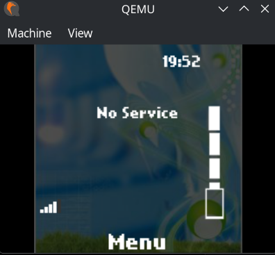
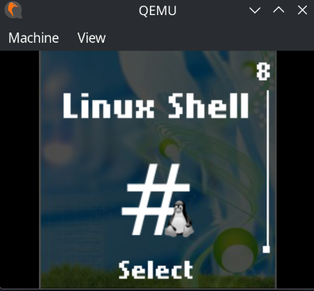
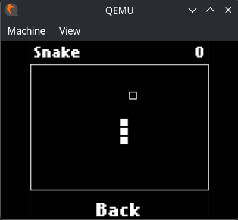
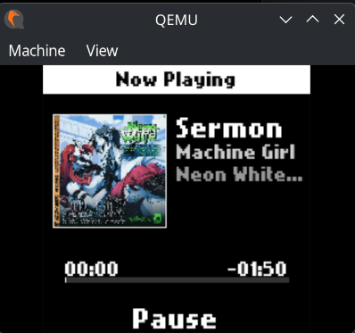

---NeoDCT

Planned Hardware (Condensed)

NeoDCT is a custom embedded Linux device designed to fit inside a Nokia 5110 / 5190 enclosure.
Compute: Radxa Zero 3W (RK3566, 1 GB RAM)
Display: 240 × 240 ST7789 IPS LCD
Input: Original Nokia keypad, wired directly to GPIO (using publically available schematics)
Connectivity: Waveshare SIM7600G-H 4G LTE modem (with GPS)
Audio: IMP441 microphone, PCM5102 DAC, PAM8302 amplifier
Power: 3000 mAh LiPo, USB-C charging
Note: Minor faceplate modifications will be required to accommodate the taller display.
Finding an ST7789 panel that matches the original Nokia aspect ratio is unfortunately difficult.

---NeoDCT OS

NeoDCT OS is a Linux-based, Python-driven feature phone OS inspired by classic Nokia devices, currently focused on UI and architecture, with full telephony planned next.

The UI is intentionally minimal, inspired by classic feature phones, but built on a modern Linux base using Buildroot.

---

## Screenshots

### QEMU (Development Environment)

> Running NeoDCT OS in QEMU for rapid development and testing.

```
docs/img/qemu-mainmenu.png
docs/img/qemu-appselector.png
docs/img/qemu-linux.png
docs/img/qemu-snake.png
docs/img/qemu-mp3player.png
```






Because NeoDCT OS is built on top of Linux, it can run more than just classic feature-phone style apps.
The following applications are included to demonstrate the platform’s flexibility and capabilities:



---

### Real Hardware (Prototype)

> Early hardware prototype (and yes, it’s literally being held together by hand.)

```
docs/images/hardware-prototype.jpg
```


Currently, this device and operating system is a **work-in-progress**, not even close to a finished product.

---

## Architecture Overview

* **Kernel**: Linux (Buildroot-managed)
* **Userspace**: Minimal GNU/Linux
* **UI**: Custom Python UI framework (framebuffer / DRM)
* **Apps**: Python scripts deployed via rootfs overlay
* **Graphics**: No heavyweight desktop stack (no X11, no Wayland compositor for UI)
* **Input**: Physical buttons / keypad navigation
* **Target hardware**: ARM SBCs and embedded platforms

All system apps are native Python programs.
No browser engine is required for core functionality.

---

## Repository Layout

```
neodct/
├── buildroot/              # Vendored Buildroot source
├── neodct/
│   ├── overlay/            # Rootfs overlay (apps, UI, assets)
│   └── configs/            # Buildroot defconfigs
├── docs/
│   └── images/             # README screenshots
├── .gitignore
└── README.md
```

* `neodct/overlay/` is copied directly into the root filesystem
* No generated files or user data are tracked in git

---

## Building NeoDCT OS

### QEMU (recommended for development)

```bash
make -C buildroot \
  BR2_DEFCONFIG=../neodct/configs/neodct_qemu_defconfig defconfig

make -C buildroot
```

Produces a bootable image suitable for QEMU.

---

### Real Hardware (example: Radxa board)

```bash
make -C buildroot O=../build-radxa \
  BR2_DEFCONFIG=../neodct/configs/neodct_radxa_defconfig defconfig

make -C buildroot O=../build-radxa
```

Output images will appear in the corresponding `output/images/` directory.

---

## Project Status

NeoDCT OS is an early-stage prototype. The core UI and app framework work, including on real hardware, but most telephony features are still unimplemented.

Legend
🟢 Working · 🟡 Mostly Working · 🟠 Stubbed · 🔴 Not Implemented

🟢 Working

Snake
Core Python UI framework
Wallpaper / theming engine (QEMU + real hardware, ST7789 240×240)

🟡 Mostly Working

Phonebook (SQLite-backed, calling buggy)
Web Browser (WebKitGTK via cage, QEMU-only, no video/downloads)
Music Player (MP3 playback, no sorting or metadata)

🟠 Stubbed

Messages (menu only)
Dialer (UI only, no logic)
Call Log
ModemService (only does "simulation mode for QEMU")
Placeholder / test apps

🔴 Not Implemented

* Telephony (calls, SMS, MMS)
* Modem integration logic
* Settings, Calculator, Tones, Memory/Logic games
* Battery & signal indicators
* Physical keypad input
* T9 / predictive text


---

## Licensing

* **NeoDCT OS code**: GPLv3
* **Linux kernel**: GPLv2
* **Buildroot**: GPLv2
* Third-party components retain their original licenses

See individual files for details.

---

## Goals

* Recreate the feel of classic Nokia feature phones (5110 / 3310)
* Modernize the concept with 4G LTE connectivity
* Add practical comfort features (GPS, MMS, etc.)
* Build on top of Linux to allow deep customization and extensibility
---

## Non-Goals

* Touch-first UX
* Heavy graphics stacks
* Doomscrollibility!!

---

## Contributing

Contributions are welcome, but expect breaking changes while the system architecture stabilizes.

If you’re experimenting with NeoDCT OS:

* Fork it
* Break it
* Fix it
* Send a PR
