# NeoDCT

**A modern LTE feature phone built inside a Nokia 5190.**

NeoDCT began as an idea about two years ago (around 2024), the looming T-Mobile's 2G
shutdown would make the original Nokia 5190 impractical to use. The idea was simple:
keep the shape, keypad, and single-purpose feel of the 5190, but replace its
internals with hardware that could work on a modern network.

It is now a working embedded-Linux prototype. It boots a custom Buildroot
image on a 64 MB ARM board, drives a physical display and the original keypad,
connects to LTE, makes and receives calls, sends and receives SMS, and runs a
small native phone interface.

<p align="center">
  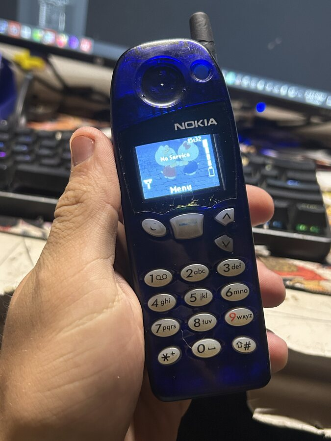
  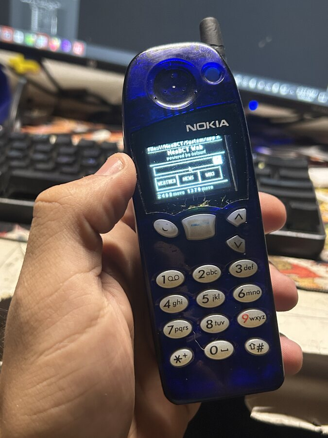
  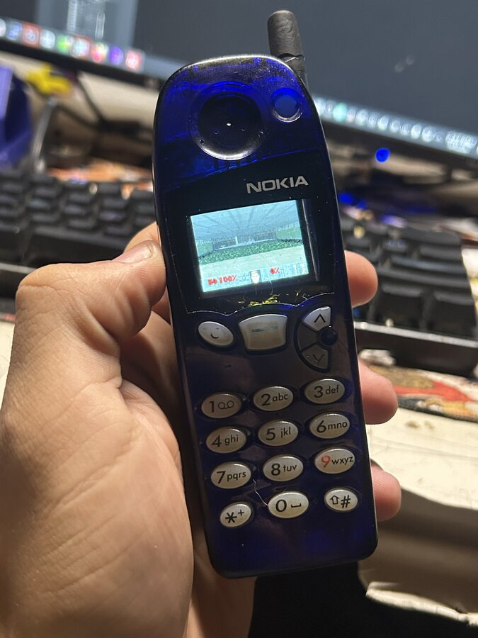
</p>
<p align="center">
  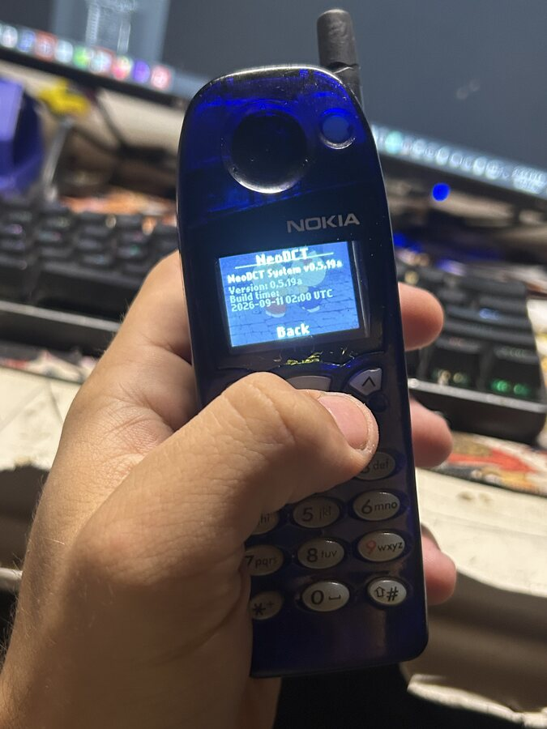
  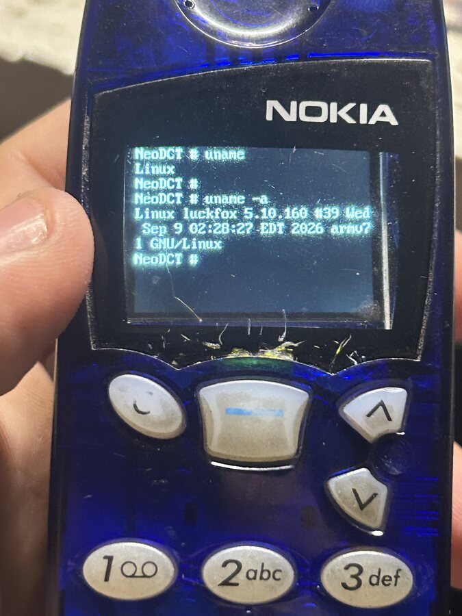
</p>

## What this project demonstrates

- Linux bring-up: Buildroot, BusyBox, musl, kernel/device-tree work, boot
  scripts, framebuffer graphics, and a 64 MB RAM budget
- Hardware integration: SPI, I2C, UART, USB, GPIO, audio, battery management,
  removable storage, Ethernet, and LTE
- IT troubleshooting: static networking, service isolation, logs, repeatable
  diagnostics, QEMU, automated tests, on-device self-tests, and recovery
- Real-hardware fault isolation involving permissions, startup timing, modem
  state, audio routing, framebuffer formats, RF reception, and power stability

## Current hardware

<p align="center">
  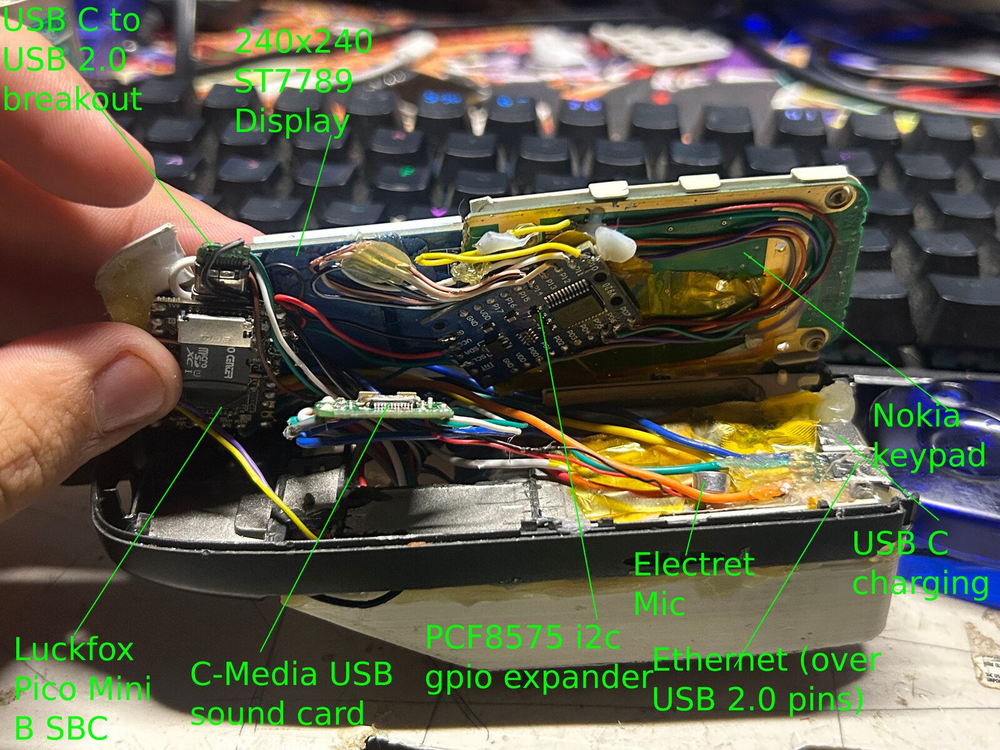
  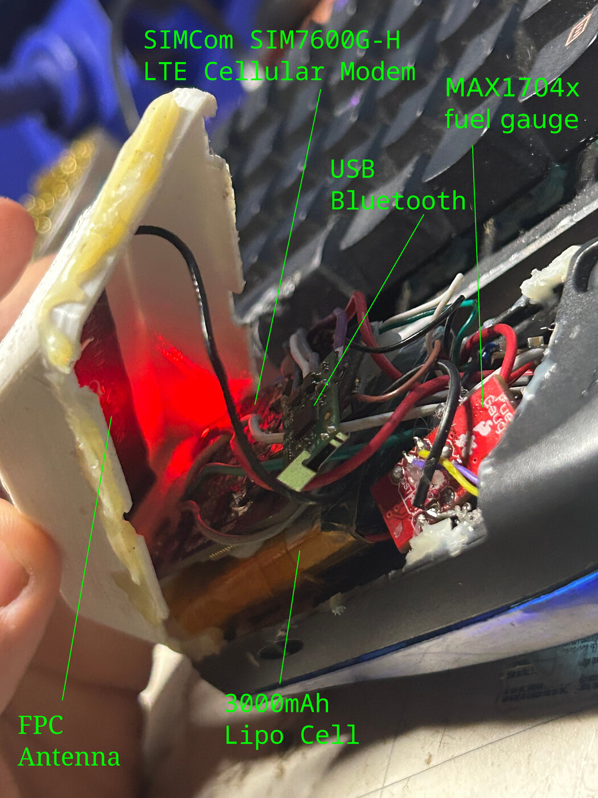
</p>

| Component | Current implementation |
| --- | --- |
| Enclosure and input | Nokia 5190 shell and original 16-key matrix, read through a PCF8575 I2C GPIO expander |
| Computer | Luckfox Pico Mini B: RV1103 Cortex-A7, 64 MB RAM, 128 MB SPI NAND |
| Display | 240×240 ST7789 IPS panel over SPI; NeoDCT renders a centered 240×175 interface |
| Cellular | SIMCom SIM7600G-H LTE modem with FPC antenna, tested on Tello/T-Mobile |
| Audio | C-Media USB sound card, electret microphone, speaker, and full-duplex 16 kHz call audio |
| Power | 3000 mAh LiPo, USB-C charging, and MAX1704x battery fuel gauge |
| Storage | Read-only verified system image plus writable user storage and removable microSD support |
| Development link | RV1103 10/100 BASE-TX exposed through a custom USB-C-to-RJ45 cable |
| Other | USB Bluetooth adapter; support remains dependent on the kernel/image being tested |

The case is a hand-built prototype, everything was wired by hand, no drop in PCB unfortunately.

## What works

- Incoming and outgoing LTE voice calls with microphone and speaker audio
- SMS, contacts, call history, signal/carrier reporting, and IPv6 mobile data
- Original physical keypad, multi-tap entry, predictive T9, and keypad-driven
  recovery
- Battery monitoring, low-battery warnings, display brightness, and idle CPU
  downclocking
- Web browsing, music playback, calendar/reminders, calculator, clock, tones,
  games, a Linux shell, and installable app packages
- UI themes: the stock Classic look plus two built-in themes (Frutiger Aero
  and Blossom), and more installable from the memory card. The stock look is
  what is verified on hardware
- Read-only squashfs under dm-verity, separated user data, app confinement,
  signed updates, crash recovery, QEMU, and automated regression tests

This is not yet a daily-driver phone. It does not enter true kernel suspend,
so standby life is limited, and the FPC antenna I'm using has unreliable
reception indoors. LTE works much more consistently outdoors.

## Solving the development-port problem

The Luckfox board has one USB controller, and NeoDCT needs it in host mode for
the LTE modem and USB sound card. That ruled out the normal embedded-device
workflow of connecting the phone to a PC as a USB gadget.

The RV1103 also contains a 10/100 BASE-TX MAC and PHY. Its two transmit and two
receive conductors are available on the board even though the Pico Mini has no
RJ45 jack. A USB 2.0 connector also provides four convenient conductors, so I
used male and female USB-C/USB 2.0 breakout boards as a compact **physical
connector only** and wired those conductors to Ethernet. A custom USB-C-to-RJ45
cable connects the phone directly to a development PC.

> This is not USB networking and must not be connected to a normal USB port.
> The USB-C connector is repurposed for the phone's Ethernet pairs.

<p align="center">
  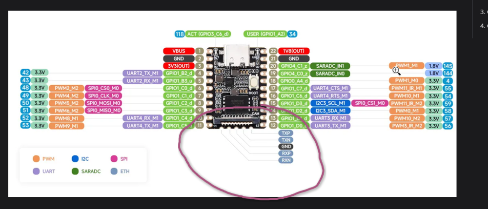
  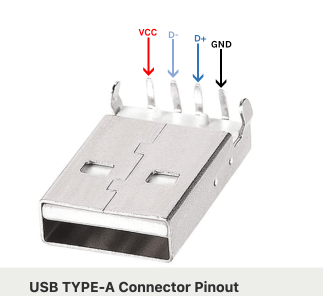
</p>
<p align="center">
  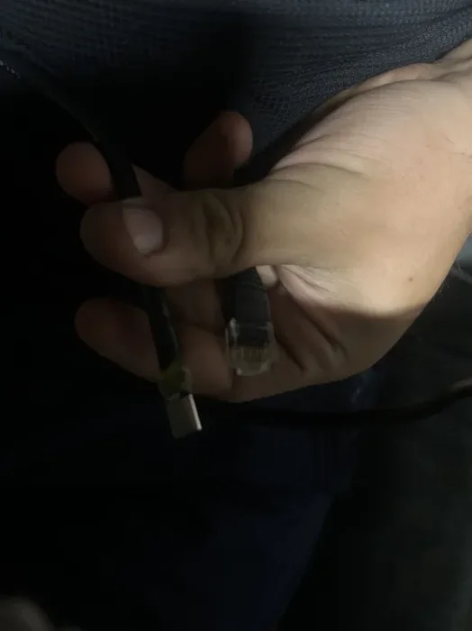
</p>

The PC uses `192.168.99.1/24`; the phone configures itself as
`192.168.99.2/24`. The link has no default route, and the debug services bind
only to the wired interface so they are not exposed over LTE. Engineering mode
starts a telnet shell, FTP file access, and VNC screen/control for bench work.

That link became **ndlink**, an adb-like tool for the phone and QEMU. It runs
commands, transfers files, captures and controls the screen, collects bug
reports, runs the on-device self-test, installs apps, and delivers updates.

```sh
neodct/tools/ndlink devices
neodct/tools/ndlink doctor
neodct/tools/ndlink --json state
neodct/tools/ndlink shell 'uname -a'
neodct/tools/ndlink shot phone.png
neodct/tools/ndlink watch
neodct/tools/ndlink bugreport
neodct/tools/ndlink selftest
```

An iTunes-style desktop companion was also prototyped on top of the same LAN
for browsing music and apps, checking device state, and syncing selected
content.

<p align="center">
  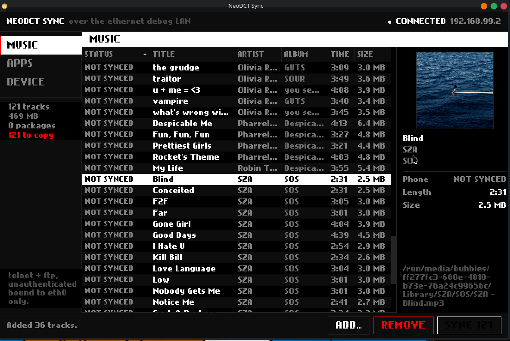
</p>

See [NDLINK.md](docs/NDLINK.md) and [DEBUG_LAN.md](docs/DEBUG_LAN.md) for the
tool and network details.

## Software design

Buildroot generates the Linux userspace. `nd-core` and the apps are native C
and draw through fbdev without X11, Wayland, or a compositor; the original
Python implementation remains as a reference. Apps run in separate processes,
the UI drops root privileges, and a small broker owns a fixed set of privileged
operations. The verified read-only OS and writable user data are separate, so
updates do not erase personal data. [How NeoDCT works](docs/HOW-IT-WORKS.md)
explains the architecture in plain language.

## Build and test

QEMU is the fastest supported development path:

```sh
cd buildroot
make neodct_qemu_defconfig
make
cd ..
neodct/tools/run_qemu.sh
```

Re-run the defconfig after it changes: Buildroot otherwise keeps an older
generated `.config`. Run both test suites before shipping a change:

```sh
cd neodct/src
make test
make ASAN=1 test

cd ../..
python3 -m pytest neodct/tests/ -q
```

The C suite runs inside bubblewrap because it exercises system operations such
as reboot and poweroff. Hardware changes are also checked with
`ndlink selftest`.

## Development note and license

AI assistants were used for portions of code generation and review. The
hardware selection and assembly, wiring, Linux bring-up, failure diagnosis,
component integration, and real-device verification were performed by the
project author.

NeoDCT code is GPLv3. Linux, Buildroot, and bundled third-party components
retain their own licenses.
