# NeoDCT

NeoDCT is a custom embedded Linux device designed to fit inside a Nokia 5110 / 5190 enclosure.

## Planned Hardware

- **Compute**: Luckfox Pico Mini B (RV1103, Cortex-A7 w/ NEON, 64 MB RAM)
- **Display**: 240 × 240 ST7789 IPS LCD
- **Input**: Original Nokia keypad, wired to a PCF8575 i2c expander (using publicly available schematics)
- **Connectivity**: Waveshare SIM7600G-H 4G LTE modem (with GPS)
- **Bluetooth**: TP-Link UB500 USB dongle
- **Audio**: IMP441 microphone, PCM5102 DAC, PAM8302 amplifier
- **Fuel gauge**: MAX1704x over i2c
- **Power**: 3000 mAh LiPo, USB-C charging

> **Note:** Minor faceplate modifications will be required to accommodate the taller display.
> Finding an ST7789 panel that matches the original Nokia aspect ratio is unfortunately difficult.
>
> The hardware target switched from a Radxa Zero 3W to a Luckfox Pico Mini B a while back. The Luckfox is a MUCH smaller and more limited board. In my opinion, this better fits the vibe of a dumb phone.

# NeoDCT OS

NeoDCT OS is a Linux-based feature phone OS inspired by classic Nokia devices, currently at **0.4.3a**. It boots, runs Snake, plays music, browses the web, and both sides of a phone call now carry real audio. Full telephony (SMS is live, calls are live but voice is receive-first) is still being finished.

The UI is intentionally minimal, inspired by classic feature phones, but built on a modern Linux base using Buildroot.

The system was originally a Python UI on top of Buildroot. It has since been rewritten in C, top to bottom, because 64 MB of RAM does not leave room for a Python interpreter and Pillow just to draw a 240×175 image. See "Architecture" below.

---

## Architecture

**Buildroot Linux underneath, one program called `nd-core` on top.**

- The kernel and userspace come from vendored Buildroot (`buildroot/`, tracked in git, not a submodule).
- `nd-core` is a single C binary, built from `neodct/src/` and installed by Buildroot's own `neodct` package (`buildroot/package/neodct/neodct.mk`, which builds straight from the working tree so `make neodct-rebuild` is the whole edit loop, no tarball, no version bump). It replaces what used to be `python3 /NeoDCT/launcher.py`, and it's genuinely the same program: `nd_main.c` is the old `launcher.py`'s `main()` followed by the old `core/main.py`'s `run()`, just in C.
- `init` (`/etc/inittab`) starts `run_neodct.sh` on tty1 with no login prompt, and that script execs `nd-core` straight onto the framebuffer. There is no window manager and no interpreter left on the phone to shell out to.
- Every app (Clock, Messages, Browser, and so on) is its own shared object with no compile-time dependency on any other, loaded by `nd-core` on demand. That's also why 24 apps could be ported in parallel instead of one at a time.
- `/` and `/NeoDCT/System` are a **read-only squashfs under dm-verity**. The only writable storage is `/NeoDCT/User`, a separate ext4 partition that the initramfs finds by disk label and mounts before `switch_root`. An update replaces the entire squashfs; anything that needs to persist has to live on `/NeoDCT/User` or be baked into the rootfs ahead of time.
- QEMU (`aarch64-virt`) is the primary development target. Real hardware (Luckfox Pico Mini B) runs the same image design, with the same read-only root and dm-verity, over `ubiblock`/`ubifs` instead of a plain squashfs partition.

Full detail on why the rewrite happened and what it bought is in `docs/c-rewrite/ARCHITECTURE.md` (idle RSS: ~33 MB in Python, targeting ~18-22 MB in C).

---

## Screenshots

### QEMU (Development Environment)

Running NeoDCT OS in QEMU for rapid development and testing.

<p float="left">
  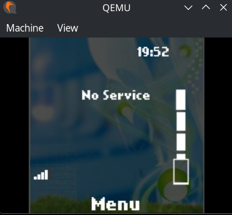
  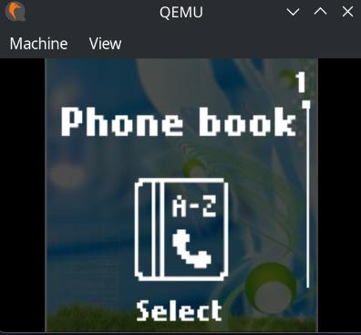
  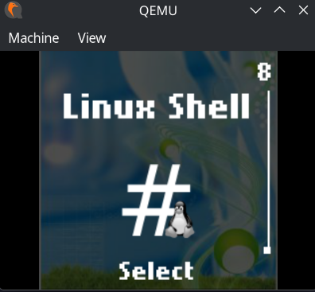
  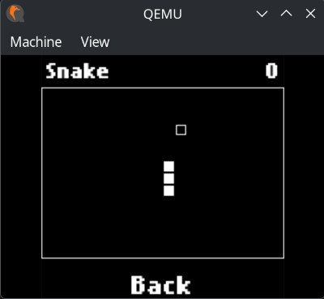
</p>

Because NeoDCT OS is built on top of Linux, it can run more than just classic feature-phone style apps:

<p float="left">
  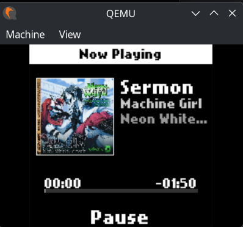
  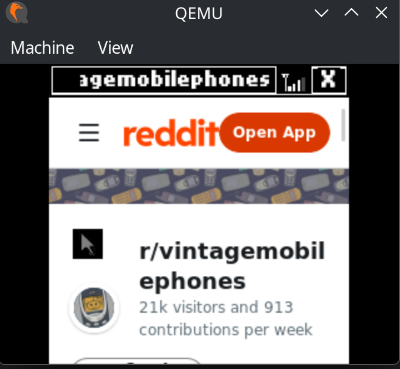
  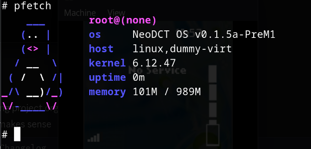
</p>

---

### Real Hardware (Prototype)

Running in the actual Nokia shell now, on real modem registration ("Tello" is my carrier), with the music player and browser both working:

<p float="left">
  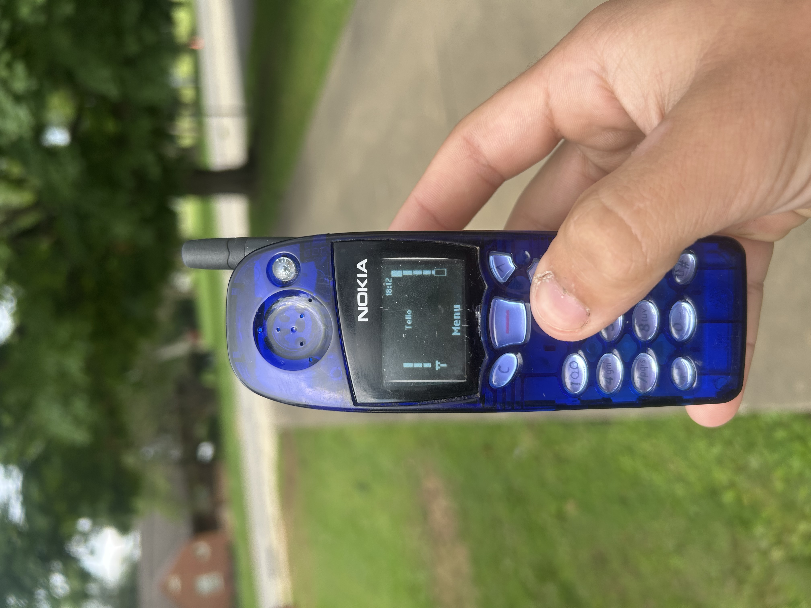
  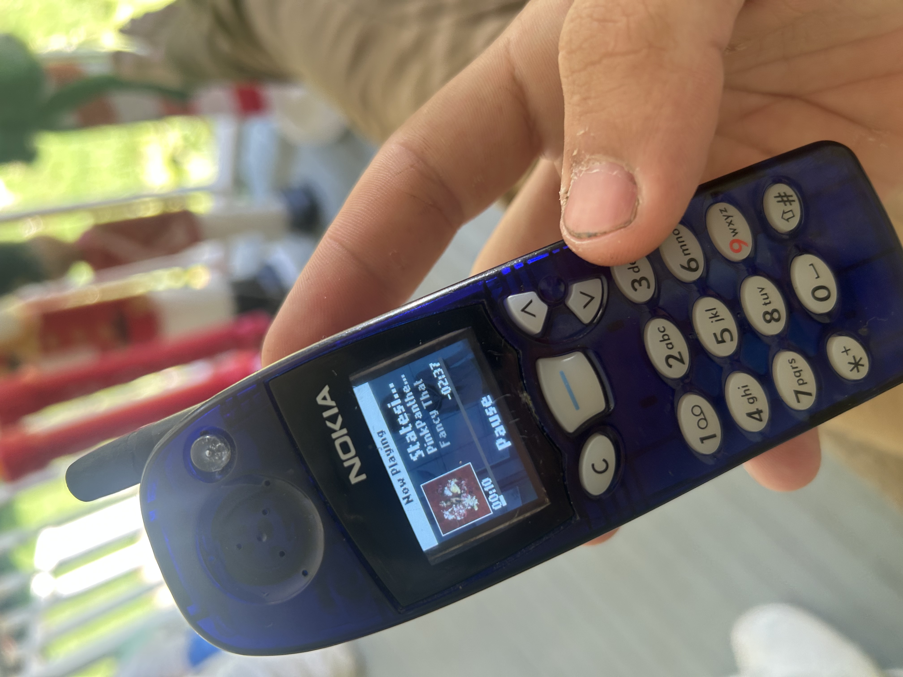
  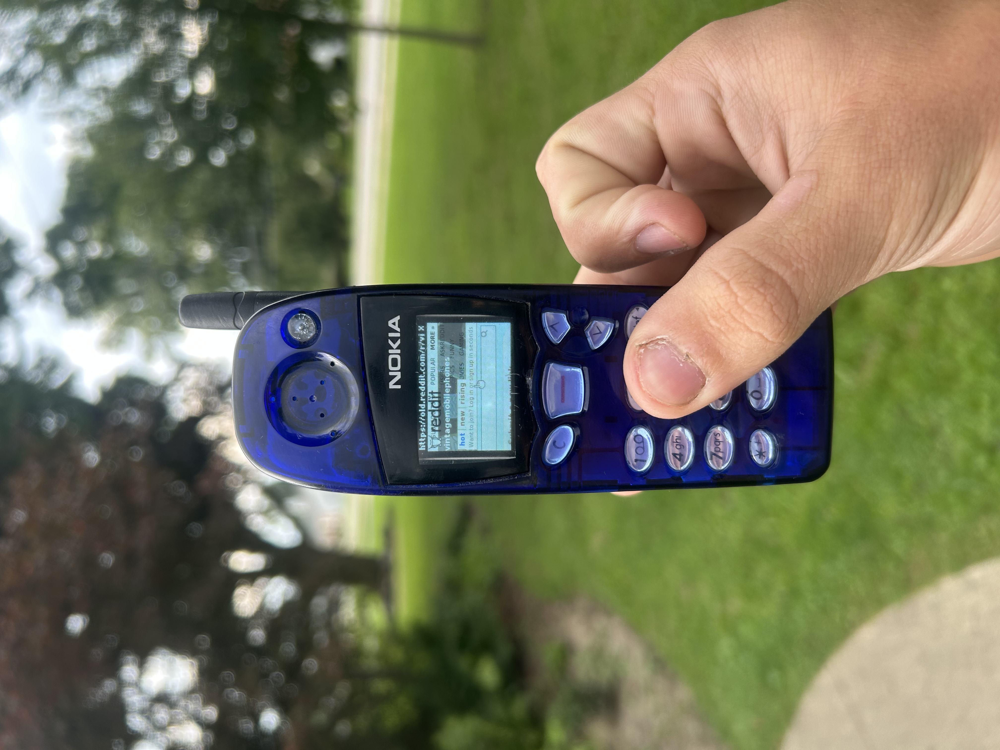
</p>

MediaWidget can also play a GIF full-screen instead of a static image, which looks great as a wallpaper-style background:

<p float="left">
  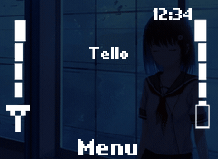
</p>

**Early bring-up**, for the record: this is where it started, screen and keypad wired to a bare board before there was an enclosure to put it in.

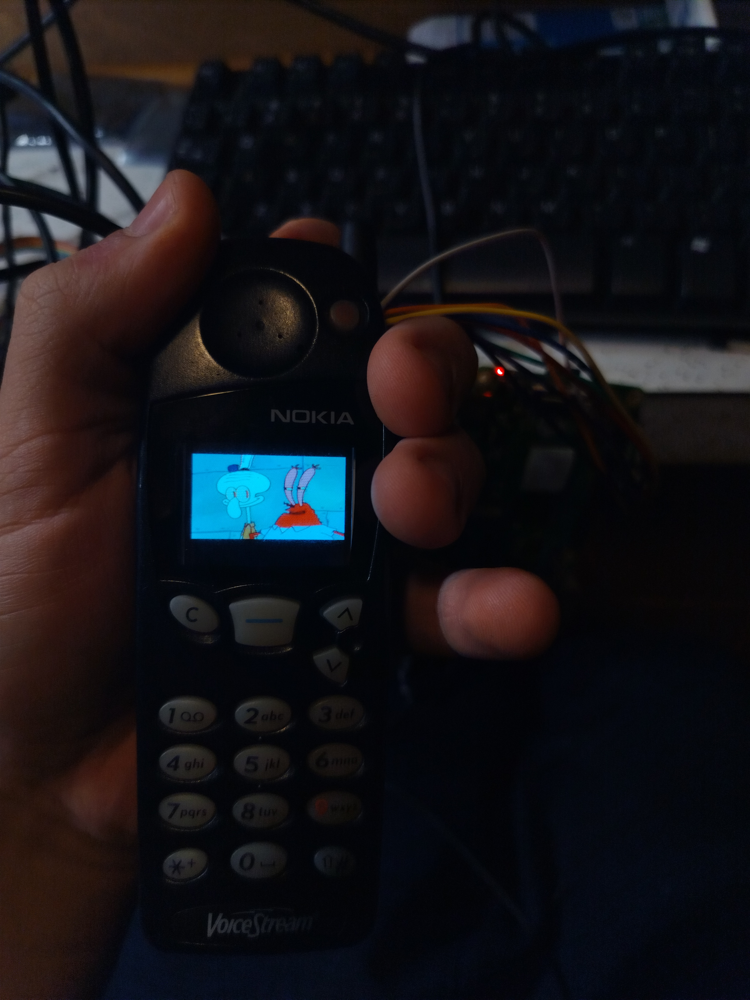
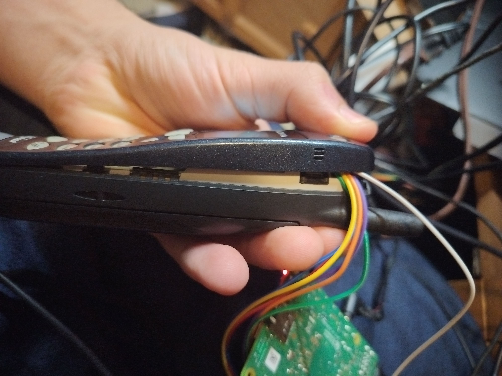
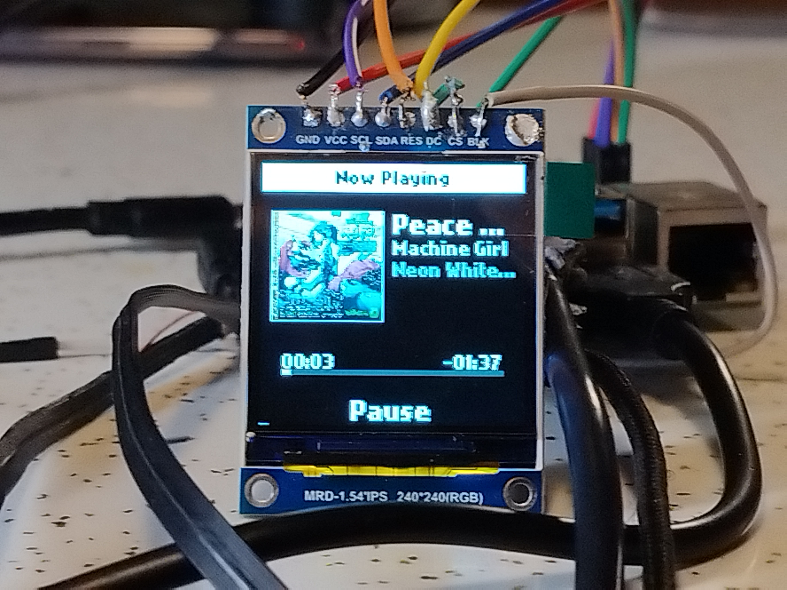

Currently, this device and operating system is a **work-in-progress**, not a finished product.

---

## Repository Layout

```
neodct/
├── buildroot/                 # Vendored Buildroot source (tracked, not a submodule)
├── neodct/
│   ├── src/                   # The OS itself, in C: lib/ core/ apps/ displayd/ mediawidget/ tools/ test/
│   ├── overlay/                # Rootfs overlay: assets only now (icons, wallpapers, tones, init scripts)
│   ├── python-reference/      # The old Python UI, kept around for reference during the port
│   ├── initramfs/             # Boot-time update applier + recovery (busybox sh, no Python)
│   ├── configs/                # Second copy of the Buildroot defconfigs (see AGENTS.md gotchas)
│   ├── scripts/                 # post-build / post-image hooks
│   ├── tools/                  # run_qemu.sh, mkupdate.py, release.sh, shoot_docs.py, and friends
│   └── tests/                  # Host-side pytest suite (update system, T9, initramfs, etc.)
├── docs/                      # Hardware notes, bring-up logs, changelog, c-rewrite specs
├── .gitignore
└── README.md
```

* `neodct/overlay/` is copied directly into the root filesystem; `neodct/src/` is built and installed into it by the `neodct` Buildroot package.
* No generated files or user data are tracked in git.

---

## Building NeoDCT OS

### QEMU (recommended for development)

```bash
cd buildroot
make neodct_qemu_defconfig
make

neodct/tools/run_qemu.sh   # from the repo root
```

`run_qemu.sh` is driven by environment variables (`NEODCT_MODEM`, `NEODCT_BT`, `NEODCT_SD`, `NEODCT_RECOVERY`, `NEODCT_VERITY`, and more). Read the header before adding a flag; the one you want probably already exists.

### Real Hardware (Luckfox Pico Mini B)

```bash
make -C buildroot O=../build-luckfox \
  BR2_DEFCONFIG=../neodct/configs/luckfox_pico_mini_defconfig defconfig

make -C buildroot O=../build-luckfox
```

Output images appear in the corresponding `output/images/` directory. The Luckfox target is on the same immutable design as QEMU now: squashfs root under dm-verity on `ubiblock0_0`, ubifs userdata on `ubi1`.

### Just the C build (fast edit loop, no image rebuild)

```bash
cd neodct/src
make            # build everything that exists
make test       # host unit tests
make ASAN=1 test
```

---

## Testing

- **C unit tests**: `cd neodct/src && make test` (`make ASAN=1 test` before pushing anything).
- **Python/host tests**: `python3 -m pytest neodct/tests/ -q` from the repo root. 500+ tests, covers the update system, T9, initramfs, and more.
- **Golden frames** (`neodct/tests/golden/`): screenshots captured from the real UI headlessly via `neodct/tools/uistub.py`, comparing pixel output against a reference. They're a regression net, not a gate: apps are still being redesigned, so a frame that stops matching because a screen changed on purpose is expected, not a failure.

---

## Updates

The phone finds updates itself: *Update* → *Look online*. It downloads a signed `.ndsw` package (the whole squashfs rootfs, zipped with a manifest and signature) for its own platform, checks the signature, and installs it. See `notes.md` and `docs/TESTING_UPDATES.md` for the full flow, including every refusal path.

Packages published from this repo are signed with the project's own development key; a phone built from your own tree will not verify them (`BAD SIGNATURE! UPDATE MAY BE CORRUPT!!`, which is the phone doing its job, not a bug). Build and sign your own with your own key: see `neodct/tools/devkey/README.md`.

---

## Project Status

NeoDCT OS is an early-stage prototype. The core UI, app framework, and now real telephony work (including on real hardware).

**Legend**: 🟢 Working · 🟡 Mostly Working · 🟠 Stubbed · 🔴 Not Implemented

### 🟢 Working
- Snake, and the rest of Koki (the game engine)
- Core UI framework and app loader (`nd-core`)
- SMS: sending and receiving are both live, push-notified over the modem, with a notification banner and unread indicator
- Signal, carrier name, and battery gauge on the home screen, all live from real hardware
- Bluetooth (scan/inquiry only, no pairing yet, engineering app only)
- Remote Shell: ssh/sftp to the phone over a relay tunnel, no serial cable needed (built, needs a real first connection and an icon)
- Music Player (in-process miniaudio streaming, browse by artist/album/song)
- Signed, verified over-the-air updates on QEMU (squashfs + dm-verity)

### 🟡 Mostly Working
- Phone calls: dialing and answering are live and now full duplex (mic uplink + speaker downlink over the modem's PCM port), gated behind a safety setting; ringing on incoming calls interrupts whatever app is running like the real 3310 did
- Web Browser (WebKitGTK via cage on QEMU; real hardware currently targets something lighter, see Goals)
- PhoneBook (SQLite-backed, shared contact picker used by Messages and the Dialer)

### 🟠 Stubbed
- Sleep: only the two low-level primitives exist (downclock, backlight off), no policy for when to use them yet
- Recovery: the applier works, but nothing in the initramfs reads the keypad, so a phone that won't boot still needs a serial console
- Clock (tells the time, no alarms yet)
- Settings, Calculator, Tones, memory/logic games
- Some Engineering apps (FuelGauge, LCDTest, CubeBench, KeypadMapper) exist to prove out hardware, not for end users

### 🔴 Not Implemented
- MMS
- Alarms
- Power states beyond the two Sleep primitives above
- T9 predictive text on a QWERTY dev keyboard (it only runs on the real i2c keypad, by design; `NEODCT_T9=1` forces it in QEMU)

See `docs/ROADMAP.md` for what's actually next and why, and `docs/CHANGELOG.txt` for everything already shipped.

---

## Licensing

* **NeoDCT OS code**: GPLv3
* **Linux kernel**: GPLv2
* **Buildroot**: GPLv2
* Third-party components retain their original licenses

See individual files for details.

---

## Goals

* Recreate the feel of classic Nokia feature phones (5110 / 3310)
* Modernize the concept with 4G LTE connectivity
* Add practical comfort features (GPS, MMS, etc.)
* Build on top of Linux to allow deep customization and extensibility
* Do all of the above inside a 64 MB RAM budget, in C, without cutting corners on tests

---

## Non-Goals

* Touch-first UX
* Heavy graphics stacks
* Doomscrollibility!! / engagement-driven UX

---

## Contributing

Contributions are welcome! I'm not the most experienced programmer! AI is the new stack overflow! :P

If you're experimenting with NeoDCT OS and want to help out, go ahead and:

* Fork it
* Break it
* Fix it
* Send a PR
