# NeoDCT: the master port plan (Python → C)

*Merged from the ten subsystem surveys in `docs/c-rewrite/spec-*.md`. Read
`ARCHITECTURE.md` first for the why, `CODING-STANDARDS.md` before writing any C, and
`SECURITY.md` before touching the update system or anything that parses a file off an SD
card.*

**Status:** plan. No C has been written yet.

---

## 1. The plan in plain English

### What we are building

The same phone, twice. Once in Python (what exists), once in C (what we are making), and
a machine that compares the two **pixel by pixel** and tells us when they disagree.

Nothing about the phone changes. Same screens, same menus, same key presses, same
wallpaper, same games, same bugs. If you put the two phones side by side you should not
be able to tell which is which — that is the entire specification, and we have a test
that enforces it.

### Why

The phone has 64 MB of RAM, about 53 MB usable. Sitting on the home screen doing nothing,
the system uses about 33 MB. Of the UI's share of that, **the actual picture on screen is
123 KB**. Everything else is the machinery needed to run Python and Pillow at all.

We are not short of memory because the phone does a lot. We are short of memory because
the tools are heavy. So we replace the tools, not the phone.

Expected result: the UI process drops from roughly 15–17 MB to roughly 5–9 MB, and total
system memory from 33 MB to something around 18–22 MB.

### The three big shape changes

Everything else in this plan is detail. These three are the actual differences:

**1. Apps become separate programs.** Today an app is a Python file that the main program
imports and runs *inside itself*. If it breaks, Python catches the error and shows a
crash screen. C has no equivalent safety net — a bad app would take the whole phone down
with it. So instead the core program starts each app as its **own process**: a copy of
itself that is immediately replaced by a tiny launcher (`nd-apprun`) which loads the
app's code and runs it. The operating system enforces the boundary in hardware. If the
app dies, the core notices, draws a crash screen, and carries on. This is *safer* than
today, not less safe. (In Python this was impossible: a second Python interpreter costs
20 MB. In C an extra process costs a few hundred kilobytes, because all the shared code
is mapped once and used by everyone.)

**2. Pillow becomes about 1,500 lines of our own drawing code.** Pillow is enormous, but
this project uses a thin sliver of it: draw a rectangle, draw a line, draw some text,
paste one picture onto another, and shrink a picture. Fifteen operations in total. We
keep FreeType — the same font renderer Pillow uses underneath — and feed it the same font
file at the same sizes, so the letters land on the same pixels. **This is the hardest and
riskiest part of the whole project**, because "the same pixels" turns out to mean copying
some very specific arithmetic that Pillow does, which we have measured rather than
guessed.

**3. The modem gets its own thread.** Today the phone only checks for an incoming call
when a screen asks for a key press — which means a call arriving while you are playing
Koki may not interrupt properly. In C the modem runs continuously in the background and
signals the app to shut down. **This is a deliberate deviation from a strict 1:1 port**;
it fixes a real bug and is flagged in `OPEN-QUESTIONS.md` awaiting your decision.

### The order of work, roughly

1. **Fix and lock the reference.** We already have 49 reference screenshots. It turns out
   they were captured on a developer laptop with a text-layout library the phone does not
   have, and **46 of the 49 are subtly wrong** as a result. We recapture them correctly
   before writing a single line of C, because otherwise we would spend weeks matching the
   wrong picture. This is one day of work and it is the single most important task in the
   project.
2. **Build the foundation.** The drawing code, the font code, the framebuffer, the
   keypad, settings, the databases. Nothing else can start without these, and one piece
   of it — the drawing and font code — genuinely cannot be split across people.
3. **Build the widget toolkit and the core program.** Lists, dialogs, text entry, the home
   screen, the app launcher.
4. **Port the apps.** Eleven stock apps, eleven engineering apps, the update system. This
   is where the work parallelises well: each app is an independent piece.
5. **Port Koki.** The game is a quarter of the whole project by volume and has its own
   miniature game engine inside it. It is deliberately last and gets its own team.
6. **Integrate, measure, and only then delete Python** from the build configuration.

### Jargon, explained once

| Term | What it means here |
| --- | --- |
| **`.so` / shared library** | A file of compiled code that several programs can use at once. `libneodct.so` holds our widgets and drawing code; the core and every app share one copy in memory. |
| **header file (`.h`)** | A short file that declares *what* functions exist and what shape the data is, without saying how they work. Two people can work in parallel as soon as they agree the header — one writes the code behind it, the other writes code that calls it. **This is why headers get frozen early in this plan.** |
| **`fork()` / `execve()`** | How Linux starts a program. `fork` makes a copy of the running program; `execve` immediately replaces that copy with a different program. Together they are what Python's `subprocess` does underneath. |
| **`waitpid()`** | How a parent program finds out what happened to a child — exited cleanly, or killed, and by which signal. This is how the core knows "the user pressed Back" from "the app crashed". |
| **golden frame** | A reference screenshot with a checksum. The C build produces the same screen, we compare checksums, and either it matches or it does not. No opinions involved. |
| **rasterizer** | The code that turns "draw a rectangle here" into actual coloured pixels in memory. Our replacement for Pillow. |
| **LANCZOS** | A specific recipe for shrinking a picture smoothly. There are many; we need Pillow's exact one, or every app icon comes out slightly different. |
| **protothread** | A C trick for writing a function that can pause in the middle and be resumed later. Python does this natively with generators; C does not, and Koki's 304 game scripts all rely on it. |

---

## 2. The shared foundation — the critical path

Nothing else can start until this exists, and it does not parallelise well. It is
roughly 6,000 lines of C, and one 1,800-line piece of it must be written by a single
person.

### 2.1 What the foundation is

| Piece | Why it blocks everything |
| --- | --- |
| **Rasterizer** (`nd_image`, `nd_draw`) | Every screen in the OS is drawn with five primitives. Every coordinate in every spec assumes their exact semantics. |
| **Font engine** (`nd_font`, `nd_text_size`, `nd_draw_text`) | ~40 places in the widget code position things by *measuring text first*. Get the measurement wrong and nearly every label on the phone moves by a few pixels — and by a *different* amount per string. |
| **Image codecs & resampling** (PNG, JPEG, LANCZOS, NEAREST) | Every app icon, every wallpaper, every status sprite. |
| **`libneodct.so`** | The shared library that holds all of the above plus the widgets, settings and storage, so the core and every app map the same pages. |
| **Core loop / `nd_ui`** | The context object every widget and every app receives. |
| **Settings / storage / databases** | Apps and core both read them; they cross the new process boundary. |
| **The app ABI** (`nd_app.h`) | Nobody can write an app until we have agreed what an app *is*. |

### 2.2 The two pieces of arithmetic that everything depends on

These were **measured**, not recalled from documentation. They are the difference between
a port that matches and one that is 46/49 frames wrong.

**Text and glyph compositing** — `ImageDraw.text()`, and Koki's alpha pastes:

```c
static inline uint8_t nd_blend8(uint8_t dst, uint8_t ink, uint8_t mask)
{
    /* Pillow's measured behaviour: +127 then a TRUNCATING divide by 255.
     * NOT the MULDIV255 macro -- that differs on 52,910 of 227,328 inputs.
     * Verified with zero mismatches over the full 227,328-combination sweep. */
    return (uint8_t)(((uint32_t)dst * (255u - mask)
                    + (uint32_t)ink * mask + 127u) / 255u);
}
```

**Wallpaper dimming** — `ImageEnhance.Brightness(img).enhance(0.3)` — uses a **different**
convention in the same codebase, and this is deliberate:

```c
out = (uint8_t)((double)v * 0.3);   /* truncates. Rounding mismatches on 128 of 256 values. */
```

Anyone who "unifies" these two for tidiness breaks all 30 wallpapered golden frames. Both
formulas go in the rasterizer's header comment with that warning attached.

### 2.3 Other foundation semantics that are load-bearing

Pinned here because five different work packages assume them:

- `draw.rectangle((x0,y0,x1,y1))` is **inclusive of both corners**. `(2,3,6,8)` lights
  x∈[2,6], y∈[3,8] — six columns, six rows.
- `draw.line(..., width=2)` grows **+1 in the minor axis only**. A vertical line at x=10
  lights columns 10 *and* 11.
- Float coordinates are **truncated toward zero**, not rounded: `8.5 → 8`.
- `"gray"` is `(128,128,128)`.
- `draw.text` anchor is `"la"`: the y you pass is the **ascender line**, not the ink top.
- `ui.get_text_size()` returns the **ink bounding box** of the laid-out string, not line
  metrics. `"_"` is 3 px tall at 20 px; `"Ag"` is 21 px tall at the same size.
- Python's `round()` is **banker's rounding**; C's `round()` is not. This reaches pixels
  in Koki's sprite positions, the T9 pencil, and the backlight percentage.

### 2.4 The headers to freeze first

**A header is a contract. Freezing it is what lets ten agents work at once.** The rule is:
the header lands (reviewed, merged, with doc comments) *before* the implementation behind
it, and before anyone who calls it starts writing.

Freeze in this order. Nothing in the right-hand column may begin before the header on its
left is merged.

| Header | Defines | Unblocks |
| --- | --- | --- |
| `include/nd/nd_types.h` | `nd_err` enum, fixed-width aliases, `nd_strlcpy`/`nd_strlcat` | literally everything |
| `include/nd/nd_paths.h` | every absolute runtime path, plus the `ND_ROOT` prefix hook the test harness needs | everything that opens a file |
| `include/nd/nd_log.h` | the tags `CORE UI MODEM BATT NOTIFY CLOCK FB INPUT OS RSHELL UPDATE` and the 256-colour palette | everything |
| `include/nd/nd_image.h` | `nd_image`, `nd_pixfmt`, `new/free/crop/blit/blit_alpha/resize_lanczos/resize_nearest/flip_h/alpha_bbox/brightness/point_lut` | rasterizer, codecs, Koki, home screen |
| `include/nd/nd_draw.h` | `rect_fill`, `rect_outline`, `line(width)`, `point`, `polygon`, `ellipse`, `text`, `bind`. **The inclusive-corner rule and the width-2 minor-axis rule go in the header comment.** | every widget, every app that draws |
| `include/nd/nd_font.h` | `nd_font`, `nd_font_load`, `nd_text_size` (**ink extents**), `nd_font_metrics` | every widget |
| `include/nd/nd_json.h` | one JSON reader for app manifests, `ui_home.json`, update manifests, Koki assets, GitHub releases | core loop, update system, Koki |
| `include/nd/nd_keycodes.h` | `28` enter, `14` clear, `103` up, `108` down, `105/106` left/right, `50` menu, `2..11` digits, `42` star, `43` hash | input, widgets, every app, both games |
| `include/nd/nd_fb.h` | `open/pack_bgra/pack_rgb565/update` | core loop, test shooter |
| `include/nd/nd_input.h` | `read_key(timeout)`, `wait_key`, `has_matrix`, `drain`, and **the cross-process key channel** | core loop, every app, Koki |
| `include/nd/nd_settings.h`, `nd_storage.h`, `nd_props.h` | `get_setting`/`set_setting`, card state machine, the three prop dialects | services, apps, update |
| `include/nd/nd_db.h` | the four schemas verbatim, `init_all`, the SMS helpers | PhoneBook, Messages, CallLog, core |
| `include/nd/nd_t9.h` | `press()`, `mode`, `modes`, `set_mode_index`, `reset`, `clear_word`, `pop_word_digit`, `word_digits`, `char_allowed`, `suggest()` | text-entry widgets, uinput bridges |
| `include/nd/nd_child.h` | fork+exec helper and the SIGCHLD reaper with owner tags `APP`/`AUDIO`/`TONE` | modem audio, notify, remote shell, app launch, Power |
| **`include/nd/nd_ui.h`** | **the `nd_ui` struct** — canvas, draw, fb, four fonts, W/H/SOFTKEY_H/content_bottom, keypad_fd, has_matrix_keypad, wallpaper, modem, home_layout, image cache | **all 13 widgets and every app** |
| `include/nd/nd_widgets.h` | the 13 widget APIs, `nd_widget_result` | every app |
| **`include/nd/nd_app.h`** | **the app ABI**: `app_run(nd_ui*)`, mandatory `app_shutdown()`, Messages' second entry points, the inherited crash-report fd, the SIGTERM teardown contract | every app, `nd-apprun`, core loop |
| `include/nd/nd_modem.h`, `nd_battery.h`, `nd_notify.h`, `nd_clock.h` | the readout contracts the UI polls | home screen, Dialer, Messages, engineering apps |
| `include/nd/nd_crash.h` | `nd_crash_info` (signal, si_code, faulting address, backtrace text) | core loop, `nd-apprun`, crash screen |
| `include/nd/nd_update.h` | error taxonomy and the verbatim on-screen message strings | Update, Downgrade |

Two headers deserve special mention because they are the ones people will get wrong:

- **`nd_ui.h`** is the single biggest contract in the project. Zero-initialise the whole
  struct before construction, and keep the documented 18-step construction order — the
  alpha security notice runs mid-construction, before `engineering_mode`, `home_layout`,
  `wallpaper` and `apps` are assigned.
- **`nd_app.h`** must settle the SIGTERM teardown contract. In Python, an incoming call
  raises an exception that unwinds through the app, and **that unwinding is what runs each
  app's `finally` block and releases the sound card before the ringtone plays**. A C
  `SIGTERM` handler that does not run the equivalent teardown leaves ALSA busy and the
  phone rings silently.

### 2.5 Two contracts that cross the new process boundary and have no design yet

These must be decided in Wave 0, not discovered in Wave 4:

1. **Held keys for a separate process.** Koki needs to know which keys are *currently
   held*, not just which were pressed. Today it reaches directly into the core keypad
   driver's private state. Once apps are separate processes that is impossible.
   **Recommendation:** the core synthesises evdev press *and release* records onto a pipe
   the child inherits as `keypad_fd`, so the app only ever needs the ordinary evdev path
   and the entire matrix-scanner branch disappears from app code. Prototype it with Koki,
   the hardest consumer.
2. **Apps that change core state.** Settings currently assigns `ui.wallpaper`, flips
   `ui.engineering_mode`, and rewrites `ui.apps` in the core's live memory.
   **Recommendation:** Settings writes only the setting; the core re-reads
   `system.ui.wallpaper` and `system.ui.engineering_mode` and rescans the app directories
   after every app exit — which is exactly what it already does for the unread-SMS count.
   This is behaviour-identical because neither change is observable before the app returns.

---

## 3. The work packages

57 packages. Sizes are estimated C lines including tests. "Verified by" says what turns
the package green.

Global rule for every package: **port the bug too.** If the Python has a quirk that shows
on screen, the C reproduces it with a comment saying why. If a number looks wrong, it is
probably load-bearing — port it and raise it in `OPEN-QUESTIONS.md`.

---

### Wave 0 — Reference and ground rules (2 agents, ~1 day, blocking)

Nothing else may start. Both packages are prerequisites for measuring anything.

**WP-01 — Golden reference recapture and oracle hardening**
*Spec:* `spec-build-test.md` §3.5, §3.9, §8.4 · *Depends on:* nothing · *~150 lines of
Python, no C*

The committed 49 reference frames were captured on a host with **libraqm** installed;
the phone's Pillow is built with `-Craqm=disable` and always uses `Layout.BASIC`. The two
lay this font out 3–10 px differently per string, and the difference **changes sign**
between sizes, so it cannot be compensated for. Recapturing with RAQM forced off changes
**46 of the 49 frames**, by up to 16.81% of the screen.

- Pin `ImageFont.core.HAVE_RAQM = False` in `goldenframe._Frozen.__enter__`, restored on
  exit like everything else.
- Assert in `capture()` that RAQM is off, so this cannot regress silently.
- Recapture: `python3 neodct/tools/goldenframe.py --out neodct/tests/golden/`.
- Harden `compare()`: it currently ignores `epoch`, `tick` and `seed` in the manifests, so
  two captures taken with different constants compare as identical. Six lines.
- Record the FreeType version in the manifest and **warn** (not fail) on mismatch.
- Add `.github/workflows/test.yml`: a pytest job and a golden job. A capture is 5.7 s and
  the suite is 22 s, so both run on every push. **There is no CI today** — without it the
  reference drifts under the C team's feet.
- Add the six coverage-gap frames now, while the reference is being rewritten anyway
  (§8.4): at least one 240×240 and one 240×170 wallpaper (**LANCZOS runs in no current
  golden frame at all** — `Palestine.jpg` is already 240×175 so `resize` short-circuits),
  T9 predictive entry, and the first-boot security notice.
- Add `.clang-format` (4 spaces, no tabs, 100-column soft limit) — `CODING-STANDARDS.md`
  tells agents to use "the repo's `.clang-format`" and it does not exist.
- Fix the "510 tests" figure in `AGENTS.md`: it is 659 test functions / 676 collected
  items / 21.9 s.
- Add a nine-line pytest asserting `buildroot/configs/` and `neodct/configs/` are
  byte-identical.

*Verified by:* `goldenframe.py --verify-determinism` passes; two independent captures
match; CI green on a fresh checkout.
**This must not be done by two agents concurrently.** One agent, one commit.

**WP-02 — Build plumbing and the skeleton tree**
*Spec:* `spec-build-test.md` §6.1–6.5 · *Depends on:* nothing · *~270 C + 70 Kconfig/make*

- `buildroot/package/neodct/{Config.in,neodct.mk}` as an in-tree `generic-package` with
  `SITE_METHOD = local`, which makes Buildroot set `NEODCT_OVERRIDE_SRCDIR` and rsync the
  working tree in on every build — so `make neodct-rebuild` is the whole edit loop.
- One line in `buildroot/package/Config.in` (record it next to the existing Makefile patch
  so a future Buildroot bump reapplies both).
- `neodct/src/` with the tree from §6.4, a plain `Makefile`, and the full warning set:
  `-std=c11 -Wall -Wextra -Werror -Wshadow -Wconversion -Wstrict-prototypes
  -Wmissing-prototypes -Wvla`, plus `-ffunction-sections -fdata-sections -Wl,--gc-sections`
  and `-Wl,-rpath,/NeoDCT/System/lib` (the rootfs is read-only squashfs; `ldconfig` cannot
  rebuild its cache at runtime).
- A stub `libneodct.so` and an `nd-core` that prints and exits, proving the loop end to end.
- `nd_path.c` / `nd_paths.h` — the `ND_ROOT` prefix hook, **introduced now**. Retrofitting
  it across ~70 call sites later is misery.
- `nd-shoot` skeleton: `--list` prints the 49 names, `--out` writes 49 black PNGs and a
  schema-correct manifest. `compare()` should then report exactly 49 `pixels` diffs and
  zero `missing` — that is the plumbing working.
- `BR2_PACKAGE_NEODCT=y` in **all four** defconfig copies.

*Verified by:* `make neodct-rebuild` succeeds; `goldenframe.py --compare` reports 49
pixel diffs and no missing frames.
**One owner for all defconfig edits for the duration of the port.**

---

### Wave 1 — Foundation (9 agents; WP-03 is the critical path)

**WP-03 — Rasterizer and font engine** ⚠️ **CRITICAL PATH — ONE AGENT, DO NOT SPLIT**
*Spec:* `spec-ui-framework.md` §0 · `spec-build-test.md` §3.8 · *Depends on:* WP-01, WP-02
· *~1,800*

`nd_image` core, `nd_draw` primitives (rect fill/outline, line with the width-2 rule,
point, polygon, ellipse, blit, blit_alpha, crop with zero padding, fill, point_lut), the
`nd_blend8` arithmetic, brightness, and the font engine: FreeType at 14/18/20/24 on
`font.ttf`, `"la"` anchoring, and `nd_text_size` as an exact port of Pillow's
`textbbox → getbbox → getsize` path returning **ink extents**.

This is one agent because two agents each implementing "close enough" produce frames that
differ from each other as well as from Python. If it must be split, the only clean seam is
`nd_draw_polygon`/`nd_draw_ellipse` (used by exactly two things: Koki's music-note icon and
Memory's 20 card glyphs, including a **self-intersecting** quadrilateral whose fill depends
on Pillow's scanline parity rule).

*Verified by:* the measured 4-size × 8-string metric table from `spec-ui-framework.md` §0
as unit tests, **before any widget exists**; the 227,328-combination blend sweep; and
golden-pixel tests for the 14 Memory glyph shapes.

**WP-04 — Image codecs and resampling**
*Spec:* `spec-koki.md` (PNG), `spec-build-test.md` §3.8.3, `spec-core-loop.md` · *Depends
on:* WP-02, `nd_image.h` · *~900*

`nd_png.c` (8-bit RGB/RGBA, non-interlaced; **ignore bKGD, cHRM, tEXt, tIME, gAMA** — all
235 Koki assets carry bKGD and most carry cHRM, and honouring any of them changes the
pixels), libjpeg with an error manager that returns partial data (`LOAD_TRUNCATED_IMAGES`
is set globally in the Python), `nd_image_resize_lanczos` as a port of Pillow's
`resample.c` (3-lobe, support 3.0, horizontal-then-vertical, same fixed-point coefficient
rounding), `nd_image_resize_nearest` with the verified sampling rule
`src_x = min(w-1, (int)((dst_x+0.5)*src_w/dst_w))`, and `nd_image_alpha_bbox` on Pillow's
rule that a pixel is empty **only when all four RGBA channels are zero**.

Independent of everything visual — verified against Pillow-generated hashes, not screens.

*Verified by:* a conformance test hashing all 235 Koki costumes plus every shipped icon and
wallpaper against a list generated once from Pillow; the ten measured status-sprite bboxes.

**WP-05 — Framebuffer**
*Spec:* `spec-core-loop.md` §2 · *Depends on:* WP-02 · *~330*

Two ioctls, an mmap, one zero-fill, the BGRA and little-endian RGB565 packers, and the
centred band write (contiguous when `dst_x==0 && row_bytes==line_length`, else row by
row). Keep the `line_length == 0 → xres*bpp/8` fallback — the Python reads `line_length` at
the 64-bit struct offset and only works because the driver reports `mmio_start == 0`. Use
the real `<linux/fb.h>` struct **and** keep the fallback.

Purely mechanical, no drawing code, testable against a file-backed `/dev/fb0` with a fake
ioctl shim. Can start on day one.

*Verified by:* unit tests against a fake fb; the 240×175 band landing at row 32 of a
240×240 panel (already pinned by `test_uistub.py`).

**WP-06 — Core utilities: errors, logging, props, JSON**
*Spec:* `spec-storage-settings.md` §B, `spec-update-system.md` · *Depends on:* WP-02 ·
*~900*

`nd_types.h`, `nd_strlcpy`/`nd_strlcat`, `nd_log` (22 tags, the two hash bands
`141 + sum%36` for apps and `22 + sum%180` otherwise, `NO_COLOR`/`NEODCT_COLOR`
handling), `nd_mkdir_p`, and **three distinct prop dialects that must not be unified**:
strict-UTF-8 whole-file (settings/version), lenient errors=replace (sdcard), and raw
unstripped lines where a leading space defeats the `#` comment check (RemoteShell). Each
difference is load-bearing in at least one existing test. Plus `nd_json.c` — one
recursive-descent reader with a hard input cap, integers distinguishable from floats,
booleans a distinct type, `\uXXXX` including surrogate pairs, last-duplicate-wins.

*Verified by:* the three dialects each with their own unit test naming the pytest that
pins them; JSON round-trips of every shipped manifest.

**WP-07 — Settings and storage**
*Spec:* `spec-storage-settings.md` §C, §D · *Depends on:* WP-06 · *~450*

The 8-entry DEFAULTS table, `SYSTEM_PREFIX` stripping, the
`defaults < settings.prop < version.prop` merge, the four SD-card states, `folder()`,
`setup_folders()`, `media_dirs()` (stock dir first, existing only), `find_updates()` with
the `UPDATE.ndsw`-first two-key sort.

Isolate the **write-on-every-read** quirk (R-24) behind one function so it can be switched
off in one line once you answer the open question.

*Verified by:* one-for-one ports of `test_settings_version_layering.py` (11) and
`test_storage.py` (17).

**WP-08 — Databases**
*Spec:* `spec-storage-settings.md` §E · *Depends on:* WP-06 · *~400*

The four schema strings **byte-exact** (contacts, inbox, outbox, calls — `calls` has **no**
WAL pragma while the other three do), `init_all` with the `'NeoDCT Support'/'555-1234'/2`
seed, the incoming-SMS store, the unread count. Keep the open/close-per-query pattern: it
is both 1:1 and correct for the memory budget.

`SELECT * FROM contacts` is consumed **positionally** as `(id, name, number, speed_dial)`,
so add a test asserting `PRAGMA table_info` returns exactly those four names in that order.

*Verified by:* schema tests; an existing `.db` from a real phone opening unchanged.

**WP-09 — Input, keymap and keypad**
*Spec:* `spec-hw-input.md` Wave 1 B+C, `spec-core-loop.md` §3–5 · *Depends on:* WP-06 ·
*~1,050*

`nd_keycodes.h` (**publish and freeze on day one — five modules include it**),
`nd_pcf8575`, `nd_matrix` (drive row low, 500 µs settle, read 16 bits, release debounce
`RELEASE_SCANS=3`, sorted new-press FIFO), `nd_keymap` (reader + atomic writer),
`nd_evdev` (six-step discovery, both 24- and 16-byte `input_event` records), and the
composed `nd_input` facade.

**This package owns the cross-process key channel** (§2.5 item 1), including synthesised
release edges for Koki.

**Zero tests exist for any of this today.** Write a fake-i2c harness (a socketpair or temp
file seeded with scripted 16-bit scan responses) *before* writing the C — fake the chip,
not the driver. That harness is reused by WP-23 and WP-52.

Recommend **dropping the gpiozero GPIO matrix backend**: it is unreachable on the target
(it needs a keymap naming a non-`pcf8575-i2c` driver *and* `/dev/gpiochip*`), and porting
it means reimplementing gpiozero over libgpiod for a path that cannot run. Log the
existing refusal line and raise the deviation.

*Verified by:* the fake-i2c harness; a keymap round-trip through the core loader.

**WP-10 — T9 engine, dictionary, uinput and bridges**
*Spec:* `spec-hw-input.md` Wave 1 A + Wave 2 E · *Depends on:* WP-06, `nd_keycodes.h` ·
*~1,000*

The multi-tap engine with its 1.0 s window and exact 6-step decision order, the on-disk
dictionary binary search (`pread`, 64-byte back-scan, **never `mmap`, never a full read,
never stdio `getline`** — the file is 2.88 MiB / 315,752 words, not the "half a megabyte"
the docstring claims), the uinput virtual keyboard, and the shell and browser bridges.

Start this **first** among the Wave-1 non-critical packages: it unblocks the text-entry
widgets and it has the best existing test coverage in the project (71 tests).

*Verified by:* direct ports of `test_t9_engine.py` (27, with the injectable clock),
`test_t9_dict.py` (17, including the exhaustive 240-word dictionary and two tests against
the real shipped `t9.dict`), `test_t9_uinput.py` (27 — **the `fd=` injection pattern must
survive into the C API as `nd_uinput_attach(fd)`** or these cannot be ported).

**WP-11 — Process plumbing and the app ABI**
*Spec:* `ARCHITECTURE.md`, `CODING-STANDARDS.md` §1.1, `spec-core-services.md` (nd_child),
`spec-storage-settings.md` (apprun_crash) · *Depends on:* WP-06 · *~580*

`nd_child.c` — one shared spawn helper (fork with `execvp` as the **first statement in the
child**, or `posix_spawn`), a pid registry tagged `APP`/`AUDIO`/`TONE`, and a SIGCHLD
reaper delivered through `signalfd` or a self-pipe. `signal(SIGCHLD, SIG_IGN)` is **not**
acceptable: the modem audio watcher logs `aplay`/`arecord` exit codes and the core
`waitpid()`s app children.

`nd-apprun`: `dlopen` the app's `app.so`, call `app_run`, plus signal handlers for
SIGSEGV/SIGBUS/SIGILL/SIGFPE/SIGABRT that write `si_signo`, `si_code`, `si_addr` and a
`backtrace()` dump to a report fd inherited from the core, then restore the default
disposition and re-raise so `waitpid()` reports the true signal.

**This package owns `nd_app.h` and the fork-then-exec rule.** Both are project-wide.

*Verified by:* an app that segfaults on purpose producing a crash report with a symbolised
frame; a DTMF-storm test showing zero zombies.

---

### Wave 2 — Framework, services and the update stack (three parallel tracks, ~14 agents)

#### Track A — the widget toolkit (depends on WP-03)

**WP-12 — UI metrics and text helpers** ⚠️ *blocks all of Track A*
*Spec:* `spec-ui-framework.md` §1 · *Depends on:* WP-03 · *~500*

`nd_ui_metrics.c` (`_header_divider_y = max(30, (int)(H*0.11))`, which evaluates to 30 —
port the formula, not the constant) and **all six** text-fitting routines: `fit_text`,
`_ellipsize`, `_wrap_lines`, the shared TextInputLong/MessageDialog long-word wrapper,
`PagedList._wrap_to_lines`, and the two Dialer fitters. **Do not merge them.** They differ
on trailing blank lines, long-word handling, the empty-result value, and whether the
marker is `"..."` or U+2026. Deduplicate only after golden frames pass, if ever.

*Verified by:* the differences table in the spec as a test matrix.

**WP-13 — UI chrome and lists** · *Spec:* `spec-ui-framework.md` §4–7, 13 · *Depends on:*
WP-12, WP-04 · *~1,050*
`SoftKeyBar` (with the transparency decided by an **explicit boolean**, replacing the
`hasattr(ui,'softkey')` construction-order trick — exactly one bar in the system is
transparent), `HeaderWidget`, `VerticalList` + `LevelSelector`, `AppSelector`, `PagedList`.
All five share the scrollbar/notch idiom, and `SoftKeyBar` is a dependency of the other
four, so it must live in this group.
*Verified by:* goldens `menu-*`, `widget-verticallist`, `widget-verticallist-scrolled`,
`widget-pagedlist`, `widget-softkeybar`, `widget-levelselector`.

**WP-14 — UI text entry** · *Spec:* `spec-ui-framework.md` §2, 3, 8, 9 · *Depends on:*
WP-12, WP-10 · *~1,110*
`nd_keymap` table, `PredictiveText`, `TextInput`, `TextInputLong`, the T9 mode indicator
and its 15×15 hand-plotted pencil (banker's rounding at sizes 14/18/22).
44 existing Python tests port first, TDD-style.
*Verified by:* `test_framework_predictive.py` (25) + `test_framework_text_input.py` (19) as
C unit tests; goldens `widget-textinput`, `widget-textinputlong`.

**WP-15 — UI pages and dialogs** · *Spec:* `spec-ui-framework.md` §10, 12, 14, 15 ·
*Depends on:* WP-12, WP-04 · *~870*
`MessageDialog` (full 0..175 clear, the ≤2-line centred look vs the left-aligned
paragraph look, the invisible `" …"` truncation marker), `TextScroller`, `InfoScreen`,
`ProgressScreen`.
*Verified by:* the 12 ProgressScreen tests in `test_update_ui.py`; goldens
`widget-messagedialog`, `widget-textscroller`, `widget-infoscreen`.

**WP-16 — DetailPage** · *Spec:* `spec-ui-framework.md` §16 · *Depends on:* WP-12, WP-04 ·
*~620*
The largest single widget. Tagged-union block list, three layout cases, the hero shrink
loop, the two-pass body wrap that reruns at 212 px when a scrollbar appears, whole-block
clipping at the fold, and the scrollbar with its 10 px thumb.
**Preallocate the 240×113 scratch column on the `nd_ui` context** — the Python allocates
81,360 bytes *every frame*, which violates `CODING-STANDARDS.md` §4.
*Verified by:* the 18 DetailPage tests in `test_update_ui.py`.

#### Track B — core services (independent of the rasterizer entirely)

**WP-17 — Modem: AT engine and state machine** · *Spec:* `spec-core-services.md` §1 ·
*Depends on:* WP-06, WP-07 · *~1,100*
`flock(LOCK_EX|LOCK_NB)` on `/tmp/neodct-modem.lock` — **`flock(2)` specifically**, because
busybox `flock` in the boot-path `atcmd` helper uses it and the two lock families do not
interact. Termios setup, a **bounded** rx buffer (see R-7), `_transact` with mid-command
URC routing, port discovery (hex `bInterfaceNumber`, iface 2/3 preferred, iface 0 dropped,
`strcmp` ordering so `ttyUSB10` precedes `ttyUSB2` — do not "fix" it), the eight-command
init sequence, all parsers, the staggered 5/20/60 s poll scheduler, the 8-slot event ring
with drop-oldest/drop-newest in the right directions, dial/answer/hangup, SMS.
**Owns the modem-thread design** (§2.5): one thread owns the fd; UI-thread entry points
post a request and block on a condvar; snapshot readouts take a short mutex.
*Verified by:* a corpus of real AT transcripts and a **pty-backed fake modem** replaying
scripted sessions — both written against the Python first. 1,084 lines with **zero tests
today**.

**WP-18 — Modem audio and simulation** · *Spec:* `spec-core-services.md` §2 · *Depends on:*
WP-17 header, WP-11 · *~400*
PCM port discovery, the raw open-configure-close with no baud set, `_find_capture_device`
over `/proc/asound`, the `aplay`/`arecord` pipes, the speaker-retries-forever /
mic-gives-up-after-3 watcher, and the four `/tmp/neodct_sim_*` hooks.

**WP-19 — Notify and ringer** · *Spec:* `spec-core-services.md` §3 · *Depends on:* WP-07,
WP-11 · *~550*
The banner state, `aplay` tones, ringtone path resolution with its full fallback chain,
and **a streaming decoder** (dr_mp3 + dr_wav or `miniaudio.h`) into a ~64 KB ring buffer
with a sample-exact wrap to frame 0. See R-9: decoding whole, as the Python does, costs up
to **6.3 MB** for a shipped ringtone.

**WP-20 — Clock and battery** · *Spec:* `spec-core-services.md` §4, §5 · *Depends on:*
WP-06 · *~630*
The offline epoch floor, the SNTP query and its three-server walk on a detached thread,
`_has_route` over both proc files; and the MAX1704x driver with its five-sample mean
summed **in insertion order** and the 3.45/3.25/3.20 V policy with 0.05 V re-arm hysteresis
and three-sample shutdown confirmation.
Prefer `clock_settime` + `ioctl(RTC_SET_TIME)` over shelling out to `date`/`hwclock` — the
clock worker is a thread and plain `fork()` there is the banned pattern.
*Verified by:* `test_clockservice.py` (14 tests) transcribed case for case; a
voltage-vector test asserting `(level, pending_warning, shutdown)` after every sample.
**Best first task for an agent finding its feet** — fully independent, complete test suite
already exists.

#### Track C — the update system (needs only `nd_json.h`; starts as soon as WP-06 lands)

**WP-21 — Crypto: SHA-256, bignum, RSA** ⚠️ *security-critical* · *Spec:*
`spec-update-system.md` §3 · *Depends on:* WP-02 · *~700*
`nd_sha256_*` (agree this header with WP-24 in the first hour or it gets written twice),
and RSA-4096 PKCS#1 v1.5 SHA-256 verification. Prefer mbedTLS's `mbedtls_mpi_exp_mod`, or
OpenSSL's `BN_mod_exp` (already in the image); an in-house Montgomery modexp is ~260 lines
and a few ms on this CPU.
**Do not use `mbedtls_pk_verify` / `RSA_verify` / `EVP_PKEY_verify`** — they reject the
bare PKCS#1 key form `load_public_key` accepts and apply their own OID rules, changing
which keys and signatures are accepted.
Rebuild the **whole** expected block (`00 01 FF…FF 00 || DigestInfo`) and compare with an
OR-accumulating constant-time loop.
*Verified by:* `test_update_signing.py` (10 tests) ported **before** writing the
implementation, including the Bleichenbacher'06 short-padding forgery, the SHA-1 OID
substitution and the fixed openssl-produced signature vector. **Second-agent line-by-line
review required.**

**WP-22 — Zip and package reader** · *Spec:* `spec-update-system.md` §5, §6 · *Depends on:*
WP-21, WP-23 headers · *~850*
EOCD scan, Zip64, central-directory walk, **local-header-derived** data offsets, CRC-32
verification, encrypted members refused, and streaming readers for stored and deflated
members. **`nd_zip_read_all()` must refuse any member over 1 MiB** — the rootfs image is
51 MB and the phone has 53.
*Verified by:* `test_update_package.py` (19); a 64 MB package extracted and hashed under a
16 MB `RLIMIT_AS`.

**WP-23 — Manifest, staging and verity** · *Spec:* `spec-update-system.md` §4, §7, §8 ·
*Depends on:* WP-06 · *~980*
The manifest validation ladder in the exact order with the exact messages; the KEY=value
record reader and writer (**newlines rejected — records are parsed, never sourced**); and
the dm-verity hash tree with its 512-byte superblock and the `dm_table` line that must
equal the shell's `verity_table()` byte for byte.
Name the two byte counts differently in C (`padded_squashfs_bytes` vs `member_bytes`) —
confusing them is R-13, and it fails or, worse, silently succeeds against a truncated image.
*Verified by:* `test_update_manifest.py` (22), `test_update_staging.py` (20), the ten
`veritysetup 2.8.6` golden root hashes plus the live cross-check;
`test_initramfs_apply.py` re-pointed at the C writer.

**WP-24 — Remote: HTTP, releases, resume** · *Spec:* `spec-update-system.md` §9 ·
*Depends on:* WP-06 (`nd_json.h`) · *~560*
A transport vtable (so the 36 existing tests can script responses) over libcurl.
**`CURLOPT_CONNECTTIMEOUT` + `LOW_SPEED_LIMIT=1` + `LOW_SPEED_TIME=120`, and never
`CURLOPT_TIMEOUT`** — Python's `timeout=` is a per-recv socket timeout, and a total
deadline would abort every 53 MB download at two minutes, reproducing the exact bug the
resume logic exists to fix. Verified TLS, no insecure flag, ever.
*Verified by:* `test_update_remote.py` (36) behind `nd_remote_set_transport()` and
`nd_remote_set_sleep_fn()`; a throttled 5 MB transfer over 120 s completing.

#### Track D — screens the core owns (depends on WP-03/WP-04)

**WP-25 — Home screen, layout and image cache** · *Spec:* `spec-core-loop.md` §8, §13 ·
*Depends on:* WP-03, WP-04, WP-05 · *~900*
`ui_home.json` parsing, `render_element` (`x = el.x*W/240`, `y = floor(el.y*175/240)`,
font ≥20 → xl, ≥16 → n, else s), the battery/signal sprites at scale 175/240, the drawn-bars
fallback (`step = max(3, int(W*0.021)) = 5`), the envelope blink, the banner, HOME_DIALING,
the boot splash, and the 32-entry FIFO image cache with its three key forms.
*Verified by:* goldens `home`, `home-nowallpaper`, `home-simulation`, `home-sms-banner`,
`home-dialing`, `home-panel`, plus the new wallpaper frames from WP-01.

**WP-26 — Crash handling and error screens** · *Spec:* `spec-storage-settings.md` §F, §G ·
*Depends on:* WP-15, WP-11 · *~650*
The byte-exact crash-log record (60 `=`, the exact space counts, local-time `strftime`,
64 KB rotation, fsync of the file **and** both directories), the engineering crash screen,
and `ErrorScreen` including the once-only alpha disclaimer.
`CRASH.jpg` is exactly 240×175, so Pillow's `resize` short-circuits to a copy — implement a
stub that **asserts** the sizes match, so a future differently-sized asset fails loudly.
*Verified by:* golden `crash-screen`, plus new goldens for the 90-character summary
(deliberately unclipped and unwrapped), the missing-`CRASH.jpg` fallback, and the alpha
notice.

**WP-27 — First-boot keypad wizard and backlight** · *Spec:* `spec-hw-input.md` Wave 2 F ·
*Depends on:* WP-03, WP-09 · *~660*
The nine wizard screen states, the 16-pin discovery scan, the graph 2-colouring that
derives the row/col split, and the atomic keymap write. Plus the three backlight tiers with
half-to-even rounding.
**These pixels are completely unverified today** — `uistub.py` never runs the wizard,
because it is called before `NeoDCT_UI` exists. WP-01 must capture goldens for all nine
states first (~40 lines of host code).

**WP-28 — Display daemon into the package** · *Spec:* `spec-hw-input.md` Wave 1 D ·
*Depends on:* WP-02 · *~30 of change to 694 kept lines*
Move `neodctDisplay.c` into the `neodct` package, install to the unchanged path
`/NeoDCT/System/hw/neodct_displayd`, and **delete the committed ARM binary**. Silence the
unsigned/int mixing that `-Wconversion -Werror` flags, without altering any arithmetic.
Keep `parse_int`'s "values under 1000 mean MHz" rule — `S90display` passes `--speed 16`.
**Nobody but this agent touches this file.** The temptation to tidy working code while
passing through is the main risk to it.

---

### Wave 3 — Core assembly (3 agents; WP-29 is serial)

**WP-29 — Core loop, `nd_ui` construction and app launch** ⚠️ *serial, one agent*
*Spec:* `spec-core-loop.md` §6, §9–12 · *Depends on:* WP-13…WP-16, WP-17…WP-20, WP-25,
WP-26, WP-11 · *~1,200*
The 18-step construction order literally as documented, `read_keypress` with its tick
ordering, `handle_input`, the fork/exec/waitpid app lifecycle, the `IncomingCall`→SIGTERM
conversion, `init_databases`, and `launcher.main`'s boot order. Touches every other
package; cannot be parallelised.

**WP-30 — `nd-shoot` and `nd-selftest`** · *Spec:* `spec-build-test.md` §4.1, §6.6 ·
*Depends on:* WP-29 (progressively — each shot goes green as its screen lands) · *~1,500*
The real golden shooter: the 49 named frames rendered through the **real** `libneodct.so`
widgets and core loop (a separate "test renderer" proves nothing), the virtual clock
(`EPOCH 1704112496.0`, `TICK 0.1` advanced by the frame-commit call, `TZ=UTC`, `gmtime_r`
where Python uses `localtime`), the writable overlay stage, per-app frame budgets, the raw-RGB
SHA-256, `--list`, and `--dump-text`. **Exits non-zero on any missing frame** — deliberately
unlike `shoot_docs.py`, which swallows per-shot exceptions and has silently produced nothing
for one whole shot group.
Plus `nd-selftest`, the line-oriented stdin/stdout bridge that lets ~536 pure-logic pytest
assertions keep running against C by swapping one import per file. **Piloting slice: the 70
T9 tests**, which are self-contained.

**WP-31 — Dialer screens** · *Spec:* `spec-ui-framework.md` §17, §18 · *Depends on:*
WP-29, WP-17, WP-35 · *~480*
`show_calling`, `draw_call_screen`, the hand-drawn handset icon, the 0.25 s redraw pacing
with two presents per frame; `show_incoming` with the 0.5 s blink, the last-10-digits
phonebook lookup and the late `+CLIP` refresh. Core-process only, so it blocks no app.
*Verified by:* goldens `call-active`, `call-incoming`.

---

### Wave 4 — Applications (13 agents, fully parallel)

Every app is a separate `.so` with no compile-time dependency on any other.

**WP-32 — Shared app helpers** ⚠️ *blocks WP-34, WP-35, WP-37* · *Spec:* `spec-apps-core.md`
Wave 0 · *Depends on:* WP-13, WP-08 · *~490*
`nd_contacts.c` (the shared contact selector — core, PhoneBook **and** Messages all call it,
so it lives in `libneodct.so`), `games_common.c/.h`, and — **only if you answer open
question 1 with "reproduce CPython"** — `nd_mt19937.c` (MT19937 with `_Py_HashDouble` float
seeding, `init_by_array`, `getrandbits`, `_randbelow` rejection sampling). See R-18.

**WP-33 — Small apps: Clock, Power, Calculator** · *Spec:* `spec-apps-core.md` · *Depends
on:* WP-13, WP-15, WP-11 · *~590*
**Run this one first and alone.** Three golden frames are the cheapest possible end-to-end
proof that the app ABI, the widget framework and the golden harness all agree.
Watch the Calculator's division by zero: Python raises and clears state; C's `1.0/0.0`
yields `inf`, which renders as "Error" but leaves `acc` and `pending_op` live. Needs an
explicit `value == 0.0` test.
*Verified by:* `app-clock`, `app-calculator`, `app-calculator-options`.

**WP-34 — Database apps: CallLog, PhoneBook** · *Depends on:* WP-32, WP-08 · *~1,040*
*Verified by:* `app-calllog`, `app-phonebook`, `contacts-picker`.

**WP-35 — Games: menus, Snake, Memory** · *Depends on:* WP-32, WP-03 (polygon/ellipse) ·
*~900*
Snake's derived board, the tick-delay table, the no-180 turn rule; Memory's 20 glyph shapes
and its `max(2, 10-2*misses)` scoring. **Start early** — this is the package that can stall
on the RNG question.
*Verified by:* `app-games`, `game-snake`, `game-memory`.

**WP-36 — Media sources: Settings, Tones** · *Depends on:* WP-13, WP-15, WP-07 · *~1,180*
One agent for both: they share the Storage scan, the helper spawn, and the "Get more…" /
"Add more…" TextScroller idiom. **Owns the Settings-mutates-core-state resolution** (§2.5
item 2). `os.walk` becomes an **explicit stack with a depth cap of 8**, not recursion — an
SD card is untrusted input.
*Verified by:* `app-settings`, `app-settings-wallpaper`, `app-tones`, plus
`test_settings_memory_card.py` (9) and `test_apps_sdcard_sources.py` (10).

**WP-37 — Messages** · *Depends on:* WP-32, WP-14, WP-17 · *~1,050*
The 160 **code-point** limit (not bytes), the `"0123456789*#+"` filter, and the second
entry points `open_message`/`open_inbox` that the notification path calls.
*Verified by:* `app-messages`, `app-messages-inbox`.

**WP-38 — MusicPlayer** · *Depends on:* WP-40, WP-04, WP-19 (shared miniaudio build) ·
*~770*
Note the deliberate quirks: the breadcrumb reads `4-N` (wrong app id), and the text column
`text_x = 116` is computed from the **pre-shrink** 100 px art size. Do not fix either.
*Verified by:* `app-musicplayer`.

**WP-39 — Browser and LinuxShell wrappers** · *Depends on:* WP-11, WP-10 · *~605*
Almost no UI — process, pipe and VT plumbing. Pairs naturally with whoever wrote
`nd_child`. Do **not** set `SA_RESTART` on the SIGTERM handler, or an incoming call cannot
interrupt the browser's blocking log pump.
*Verified by:* `test_browser_exit_report.py` (4), `test_browser_drain.py` (4),
`test_linuxshell_t9.py` (3).

**WP-40 — ID3v2 metadata reader** · *Depends on:* WP-02 only · *~380*
Split out deliberately: it is pure file parsing with no UI knowledge, replaces `mutagen`,
and can start in Wave 1. ID3v2.2/2.3/2.4, exactly `TIT2`/`TPE1`/`TALB`/first `APIC`, all
four text encodings, sync-safe sizes, unsynchronisation.

**WP-41 — Engineering A: gate, Crash, TestsApp, LCDTest, CubeBench** · *Spec:*
`spec-engineering.md` E1+E2 · *Depends on:* WP-13, WP-15 · *~565*
CubeBench integrates its rotation over `perf_counter` deltas through 240 iterations:
**`double` everywhere, no `-ffast-math` on that translation unit**, and unit-test the three
final angles before comparing pixels.
*Verified by:* `eng-tests`, `eng-lcdtest`, `eng-cubebench`, plus a menu-order assertion for
both engineering-mode states.

**WP-42 — Engineering B: keypad mappers and the console tool** · *Spec:*
`spec-engineering.md` E3 · *Depends on:* WP-09, WP-27 · *~900*
`nd_keymap_write.c` plus its three consumers as **one agent** — splitting them guarantees
three divergent JSON writers. On a shipped image `KeypadMapper` (gpiozero) can only display
one of two error dialogs; reproducing exactly that is the default (see R-32).

**WP-43 — Engineering C: FuelGauge, Modem app, `nd-fuelwatch`** · *Spec:*
`spec-engineering.md` E4 · *Depends on:* WP-20, WP-17 · *~865*
*Verified by:* `eng-fuelgauge`, `eng-modem`. Note `eng-fuelgauge` is a stub artefact —
it renders `'NoneType' object cannot` because the harness forces `hardware` true with no
fd. Either reproduce that state in `nd-shoot`, or re-cut that one golden and record why.

**WP-44 — Update and Downgrade apps** · *Spec:* `spec-update-system.md` §10, §11 ·
*Depends on:* WP-21…WP-24, WP-15, WP-16 · *~1,050*
Hoist `_install` into `libndupdate.so` as `nd_update_install()` so Downgrade calls it
directly instead of the Python `importlib` trick.
*Verified by:* `test_systemupdate_app.py` (48 tests against fake widgets — **these can all
pass before the real UI framework lands**, using the Recorder pattern) and
`test_update_flow.py` (12 on real pixels).

**WP-45 — RemoteShell service and app** · *Spec:* `spec-storage-settings.md` §H · *Depends
on:* WP-06, WP-11, WP-14 · *~810*
Byte-exact generated `sshd_config` and `tunnel.sh`, the 15-argument tunnel argv, and the
`/proc/<pid>/cmdline` ownership check. **Copy the comment at `RemoteShell/__init__.py:371`
verbatim** — the bug that check prevents killed the launcher's own process group on a real
phone and left no error anywhere.
*Verified by:* `test_remoteshell.py` (27), including the real-`sh` shell-injection test and
the four stale-pid tests, **ported before the implementation**.

---

### Wave 5 — Koki (10 agents; its own sub-project)

11,500 lines — a quarter of the port. Runs after the engine API is frozen.

**WP-46 — Koki runtime A: scheduler, engine loop, manifest, caches** ⚠️ *blocks all game
files* · *Spec:* `spec-koki.md` §4, §12 · *Depends on:* WP-03, WP-04, WP-06 · *~1,660*
The protothread macros with **per-script explicit context structs** (C has no generators;
any stack local crossing a yield is silently lost — a review rule bans non-static locals
declared before a `KOKI_YIELD`), the insertion-ordered active map, the **one-frame broadcast
latency** (snapshot the active list before stepping — "helpfully" running new scripts in the
same frame shifts every cutscene by a frame), and the byte-budgeted LRU caches with the
`/proc/meminfo` tiering.

**WP-47 — Koki runtime B: sprites, render, collision, input** · *Depends on:* WP-46 header
· *~1,260*
Three coexisting roundings: half-to-even for paste positions and `size_q`, floor for
`ghost_q`/`bri_q`, truncate-toward-zero for `int()`. **Fold the brightness and ghost LUTs
into the blend loop** — pixel-identical, and it deletes the entire 1 MB fx cache, which
currently sits at budget in every scene and thrashes.

**WP-48 — Koki audio** · *Depends on:* WP-11 · *~700* — fully parallel from day one;
testable standalone against the 57 real asset files with no engine at all. Vendor `minimp3`;
**stream**, never decode whole (183 s at 22050 Hz is 8.1 MB). **Recommend dropping the
external-player fallback entirely**: it forks from a process with an audio thread, and
Buildroot ships none of `aplay`/`mpg123`/`mpv` for this path anyway.

**WP-49 — Koki harness and smoke scenarios** · *Depends on:* WP-46, WP-47 · *~380* —
fully parallel; this agent should also generate the Python-side reference frames so Wave 5b
has something to diff against on day one.

**WP-50…WP-55 — the 304 game scripts**, one agent each, after the engine API is **frozen**:
`boot/common` (~1,320) · `player + lobby` (~1,130, must land first within the wave because
every level collides against ANIM) · `level 1` (~800) · `level 2` (~850) · `level 3 +
ending` (~910) · `final boss` (~1,050).

Hard rule: every agent registers through one `koki_game_register_all()` that calls the seven
per-file registration functions in `game.py` source order. **Registration order is part of
the behaviour** and cannot be left to link order or to taste. No agent may add, remove or
reorder a handler; if the spec looks wrong it goes to `OPEN-QUESTIONS.md`, not into the code.

**WP-56 — Koki integration** · *~200* — the full-playthrough frame diff, memory measurement
on the 53 MB target, and the `NEODCT_KOKI_ATTACK_SLOW=1.0` A/B check.

---

### Wave 6 — Integration and the Python removal

**WP-57 — Integration, measurement and defconfig cleanup** · *Spec:* `spec-build-test.md`
§5.2, §5.3, §5.6 · *Depends on:* everything · *~200 of config, weeks of chasing*

- All 49+ golden frames green on both a host build and the device.
- Measure real RSS on hardware against the 5–9 MB target.
- **Then and only then** delete the seven Python lines from the defconfigs — and in the
  **same commit** add `BR2_PACKAGE_SQLITE=y`, `BR2_PACKAGE_OPENSSL=y` and
  `BR2_PACKAGE_ZLIB=y`. See R-14: sqlite is reachable today *only* through
  `BR2_PACKAGE_PYTHON3_SQLITE`, so removing Python without adding it yields an image that
  builds, boots, and has **no phonebook**.
- Add `BR2_PACKAGE_LIBPNG=y` (Pillow decoded PNG itself; libpng has never been built for
  this target).
- Set `BR2_OPTIMIZE_S=y`.
- `run_neodct.sh`: `python3 /NeoDCT/launcher.py` becomes `/NeoDCT/System/bin/nd-core`.
  Everything before and after that line stays exactly as it is.
- Evaluate musl/uClibc-ng (~1.5 MB) **on a separate branch, after the oracle is green**.

---

**Total: 57 work packages, ≈ 50,000 lines of C.**

| Wave | Packages | ≈ C LOC |
| --- | --- | --- |
| 0 — reference and plumbing | 2 | 300 |
| 1 — foundation | 9 | 7,400 |
| 2 — framework, services, update | 17 | 12,500 |
| 3 — core assembly | 3 | 3,200 |
| 4 — applications | 14 | 10,900 |
| 5 — Koki | 11 | 15,500 |
| 6 — integration | 1 | 200 |

---

## 4. The dependency graph

```mermaid
graph TD
    subgraph W0["Wave 0 — blocking, ~1 day"]
        WP01["WP-01 Golden reference<br/>recapture + CI"]
        WP02["WP-02 Buildroot package<br/>+ skeleton + ND_ROOT"]
    end

    subgraph W1["Wave 1 — foundation"]
        WP03["WP-03 Rasterizer + font<br/>CRITICAL PATH, 1 agent"]
        WP04["WP-04 PNG/JPEG/LANCZOS"]
        WP05["WP-05 Framebuffer"]
        WP06["WP-06 err/log/props/JSON"]
        WP07["WP-07 Settings + storage"]
        WP08["WP-08 Databases"]
        WP09["WP-09 Input + keymap"]
        WP10["WP-10 T9 + uinput"]
        WP11["WP-11 nd_child + app ABI<br/>+ nd-apprun"]
    end

    subgraph W2A["Wave 2A — widgets"]
        WP12["WP-12 metrics + 6 wrappers"]
        WP13["WP-13 chrome + lists"]
        WP14["WP-14 text entry"]
        WP15["WP-15 pages + dialogs"]
        WP16["WP-16 DetailPage"]
    end

    subgraph W2B["Wave 2B — services"]
        WP17["WP-17 Modem AT + state"]
        WP18["WP-18 Modem audio + sim"]
        WP19["WP-19 Notify + ringer"]
        WP20["WP-20 Clock + battery"]
    end

    subgraph W2C["Wave 2C — update stack"]
        WP21["WP-21 SHA/RSA crypto"]
        WP22["WP-22 Zip + package"]
        WP23["WP-23 Manifest/staging/verity"]
        WP24["WP-24 Remote HTTP"]
    end

    subgraph W2D["Wave 2D — core screens"]
        WP25["WP-25 Home + layout + cache"]
        WP26["WP-26 Crash + error screens"]
        WP27["WP-27 Keypad wizard"]
        WP28["WP-28 Display daemon"]
    end

    subgraph W3["Wave 3 — core assembly"]
        WP29["WP-29 Core loop + launch<br/>SERIAL"]
        WP30["WP-30 nd-shoot + nd-selftest"]
        WP31["WP-31 Dialer screens"]
    end

    subgraph W4["Wave 4 — apps (parallel)"]
        WP32["WP-32 shared helpers"]
        WP33["WP-33 Clock/Power/Calc"]
        WP34["WP-34 CallLog/PhoneBook"]
        WP35["WP-35 Games"]
        WP36["WP-36 Settings/Tones"]
        WP37["WP-37 Messages"]
        WP38["WP-38 MusicPlayer"]
        WP39["WP-39 Browser/LinuxShell"]
        WP40["WP-40 ID3 reader"]
        WP41["WP-41 Eng A"]
        WP42["WP-42 Eng B mappers"]
        WP43["WP-43 Eng C instruments"]
        WP44["WP-44 Update/Downgrade"]
        WP45["WP-45 RemoteShell"]
    end

    subgraph W5["Wave 5 — Koki"]
        WP46["WP-46 scheduler/engine"]
        WP47["WP-47 sprite/render/collide"]
        WP48["WP-48 audio"]
        WP49["WP-49 harness"]
        WP50["WP-50..55 304 scripts<br/>6 agents"]
        WP56["WP-56 Koki integration"]
    end

    WP57["WP-57 Integration + drop Python"]

    WP01 --> WP03
    WP02 --> WP03
    WP02 --> WP04
    WP02 --> WP05
    WP02 --> WP06
    WP02 --> WP21
    WP06 --> WP07
    WP06 --> WP08
    WP06 --> WP09
    WP06 --> WP10
    WP06 --> WP11
    WP06 --> WP23
    WP06 --> WP24
    WP03 --> WP12
    WP12 --> WP13
    WP12 --> WP14
    WP12 --> WP15
    WP12 --> WP16
    WP04 --> WP13
    WP10 --> WP14
    WP07 --> WP17
    WP17 --> WP18
    WP11 --> WP18
    WP11 --> WP19
    WP06 --> WP20
    WP21 --> WP22
    WP23 --> WP22
    WP03 --> WP25
    WP04 --> WP25
    WP05 --> WP25
    WP15 --> WP26
    WP11 --> WP26
    WP03 --> WP27
    WP09 --> WP27
    WP02 --> WP28
    WP13 --> WP29
    WP14 --> WP29
    WP15 --> WP29
    WP16 --> WP29
    WP17 --> WP29
    WP19 --> WP29
    WP20 --> WP29
    WP25 --> WP29
    WP26 --> WP29
    WP11 --> WP29
    WP29 --> WP30
    WP29 --> WP31
    WP17 --> WP31
    WP13 --> WP32
    WP08 --> WP32
    WP29 --> WP33
    WP32 --> WP34
    WP32 --> WP35
    WP32 --> WP37
    WP29 --> WP36
    WP14 --> WP37
    WP17 --> WP37
    WP40 --> WP38
    WP19 --> WP38
    WP11 --> WP39
    WP10 --> WP39
    WP29 --> WP41
    WP09 --> WP42
    WP27 --> WP42
    WP20 --> WP43
    WP22 --> WP44
    WP24 --> WP44
    WP16 --> WP44
    WP11 --> WP45
    WP03 --> WP46
    WP04 --> WP46
    WP46 --> WP47
    WP11 --> WP48
    WP47 --> WP49
    WP49 --> WP50
    WP50 --> WP56
    WP30 --> WP57
    WP33 --> WP57
    WP34 --> WP57
    WP35 --> WP57
    WP36 --> WP57
    WP37 --> WP57
    WP38 --> WP57
    WP39 --> WP57
    WP41 --> WP57
    WP42 --> WP57
    WP43 --> WP57
    WP44 --> WP57
    WP45 --> WP57
    WP56 --> WP57
```



---

## 5. Verification strategy

"One-to-one" must be something a machine decides, not something a person argues about.
The project already has most of the machinery; this section says how it becomes the port's
pass/fail definition.

### Rung 1 — Determinism (already working)

`neodct/tools/goldenframe.py --verify-determinism` captures twice and compares. Verified
during the survey: 5.65 s per capture, both runs identical to the committed set.

Determinism comes from `_Frozen`, which pins:

| Knob | Value |
| --- | --- |
| `EPOCH` | `1704112496.0` (2024-01-01 12:34:56 UTC) |
| `TICK` | `0.1` s, advanced **after** each `fb.update()` returns |
| `SEED` | `20240101` |
| `TZ` | `UTC`, set in `os.environ` **and** `time.tzset()` |
| layout engine | **`HAVE_RAQM = False`** — added by WP-01 |

The clock is **virtual, not frozen**: freezing outright deadlocks anything waiting for time
to pass (the `+CLIP` grace period, the cursor blink, the modem backoff). `now() == EPOCH +
frame * TICK`, so it is deterministic, monotonic and frame-aligned. `perf_counter` is on the
patch list specifically because CubeBench integrates its rotation over `perf_counter` deltas.

The C shooter must reproduce all of it, including the detail that `time.localtime` is
**aliased to `gmtime`** — use `gmtime_r` where the Python uses `localtime`.

### Rung 2 — Exact pixel equality (the real oracle)

```
Python build ──uistub/goldenframe──►  neodct/tests/golden/*.png + manifest.json
                                                    │
C build      ──nd-shoot ──────────►  /tmp/c-frames/*.png + manifest.json
                                                    │
                            goldenframe.py --compare golden/ c-frames/
```

The digest is SHA-256 over `b"%d,%d|"` followed by **raw top-down RGB with no row
padding** — 126,000 bytes for a band frame, 172,800 for a panel frame. Not the PNG file:
two encoders write different bytes for identical images. The PNG is written only so
`_describe_pixel_diff()` can print `"<n> px (<pct>%) in box (l, t, r, b)"` and point you at
the wrong region.

`compare()` is **already build-agnostic** and needs no changes to judge C output. It
classifies each frame as `extra`, `missing`, `size` or `pixels`, and exits 0/1.

Every rendering work package's definition of done is "my golden frames are byte-identical".

### Rung 3 — Structural properties (works long before rung 2 is green)

`test_update_ui.py` has 32 tests that assert geometric invariants on real drawn pixels
using twelve lines of helpers (`lit_pixels` / `is_clear`): nothing overlaps the progress
bar, nothing spills into the softkey bar, the paragraph gap is strictly between 0 and one
line height, a scrolling page starts at the top, no half-line at the fold. Point those
helpers at a C frame dump and they judge the C build unchanged — which gives app agents a
usable green signal weeks before exact equality arrives.

### Rung 4 — Text presence

`nd-shoot --dump-text` emits one line per text draw. `test_systemupdate_app.py`'s
`Recorder.page_text()` does the same thing at widget level for 48 policy tests, which can
pass against **fake widgets before the real framework exists**.

### Rung 5 — The pytest suite, kept alive

659 test functions, 9,399 lines, and — this is the point — every edge case in them exists
because this project once had that bug. Rewriting them into a C test framework throws away
the comments explaining why, which are the most valuable thing in the suite.

`nd-selftest` (WP-30) is a line-oriented stdin/stdout bridge:

```
$ nd-selftest t9.candidates 228
cat
bat
act
```

Each pure-logic test file swaps one import for a thin `selftest(...)` helper and keeps every
assertion. Pilot with the 70 T9 tests.

Tests that already sit at a file or subprocess boundary — `test_initramfs_apply.py`,
`test_remoteshell.py`, `test_sdcard_helper.py`, `test_post_build_*` — mostly need only
re-pointing, or nothing at all.

### Rung 6 — Unit tests for what has no oracle

The following have **zero coverage today** and need new host tests written from the specs
*before* the C:

| Untested area | Test to write | Owner |
| --- | --- | --- |
| ModemService (1,084 lines) | AT transcript corpus + pty-backed fake modem | WP-17 |
| NotifyService, BatteryService policy | voltage-vector test asserting `(level, warning, shutdown)` per sample | WP-19, WP-20 |
| PCF8575 scanner, matrix, keymap loader | fake-i2c fd with scripted scan responses | WP-09 |
| First-boot wizard (all nine screens) | goldens captured from the Python | WP-01 → WP-27 |
| CrashHandler, ErrorScreen, logstyle | string-exactness unit tests | WP-26, WP-06 |
| Koki (entire) | `tools/harness.py` twin + the six `smoke.py` scenarios (59 frames) | WP-49 |

### Rung 7 — On the device

Host and target differ in FreeType version (2.14.3 vs 2.14.1) and libjpeg build (SIMD on
ARM). The cheapest real check is to run `nd-shoot` on the phone over the serial console and
compare its manifest against the host capture. Do this once, early — as soon as WP-03 and
WP-25 land — not at the end.

### Coverage gaps in the reference set — fix in WP-01

- **LANCZOS runs in no golden frame at all.** `Palestine.jpg` is already 240×175, so
  Pillow's `resize` short-circuits to a copy. A wrong C LANCZOS would pass the oracle
  silently while every app icon and every other wallpaper is wrong.
- 9 of 24 apps are unshot: Update, Power, Browser, Crash, Downgrade, both KeypadMappers,
  LinuxShell, RemoteShell.
- T9 predictive entry has 25 tests and **zero pixels**.
- The first-boot security notice is suppressed in every shot (`skip_notice=True`).

Six additions, 3–6 lines each in `shoot_docs.py`, turn four invisible hazards into checked
ones.

---

## 6. Risk register

Merged and deduplicated from all ten surveys. Ranked by severity, then by how early it
bites.

### High

| # | Risk | Mitigation | Owner |
| --- | --- | --- | --- |
| R-1 | **The committed golden reference is not device-accurate.** Captured with libraqm; the phone's Pillow has `-Craqm=disable`. 46 of 49 frames differ, up to 16.81%. Matching it would match the developer's laptop, not the phone. | Pin `HAVE_RAQM = False`, recapture, assert it in `capture()`. **Before any C exists.** | WP-01 |
| R-2 | **No CI.** Nothing enforces that 659 tests pass or that the golden set still matches. The reference can drift under the C team's feet and the port goes mysteriously red weeks later. | `.github/workflows/test.yml` with a pytest job and a golden job. 28 s total. | WP-01 |
| R-3 | **`nd_text_size` returns ink extents, not line metrics.** ~40 call sites centre and stack with it. A C helper returning the obvious FreeType answer shifts nearly every label — by a *different* amount per string (`"_"` is 3 px, `"Ag"` is 21 px at the same size). | Exact port of Pillow's `textbbox → getbbox → getsize`. The measured 4×8 table is the **first** unit test, before any widget. | WP-03 |
| R-4 | **Text compositing arithmetic.** `(dst*(255-m) + ink*m + 127)/255`, truncating. Pillow's own `MULDIV255` macro differs on 52,910 of 227,328 inputs. | Use the measured formula; run the full sweep as a test; golden-frame a VerticalList with a selected row to catch a wrong blend direction. | WP-03 |
| R-5 | **Wallpaper dimming truncates while text rounds** — two conventions in one codebase, deliberately. Unifying them breaks all 30 wallpapered frames. | Both formulas in the rasterizer header comment with that warning. | WP-03 |
| R-6 | **LANCZOS mismatch**, and **no golden frame exercises it**. Every app icon (120→82), every non-Palestine wallpaper, every status sprite, every DetailPage thumbnail. Could be arbitrarily wrong and the oracle passes. | Port Pillow's `resample.c` rather than approximating; add the wallpaper coverage frames in WP-01. | WP-04, WP-01 |
| R-7 | **Unbounded allocation on a 53 MB phone.** The modem's rx buffer grows forever on a port emitting binary with no newline (the DIAG port is exactly this). `all_releases()` reads GitHub's whole response uncapped. A 10000×10000 thumbnail fits under the 256 KiB member cap and decodes to 300 MB. | Hard caps: 8 KB rx (discard + log once), 1 MiB HTTP body, 1 MiB manifest, 1 KiB signature, 512×512 decoded PNG. Record each as a deliberate hardening deviation. | WP-17, WP-24, WP-04 |
| R-8 | **The 51 MB system image reaching RAM.** A naive `read_member()` returning a malloc'd buffer is an instant OOM kill. | Streaming reader only; `nd_zip_read_all()` refuses members over 1 MiB; test under a 16 MB `RLIMIT_AS`. | WP-22 |
| R-9 | **Ringtone decoded whole: up to 6.3 MB.** One user ringtone choice can exceed the entire 8 MB budget the moment the phone rings. | Streaming decoder into a ~64 KB ring buffer with a sample-exact wrap. Audibly identical (the Python loop already has no gap or fade). Plus a size cap falling back to `Low.mp3`. | WP-19 |
| R-10 | **A weakened signature check.** A verifier that searches for the DigestInfo, accepts a short `0xFF` run, accepts a SHA-1 OID, or short-circuits the compare makes forged updates installable — **and the phone shows the "Verified" badge while installing them.** | Port `test_update_signing.py` first, including both forgeries. Rebuild the whole block. Constant-time OR-accumulating compare. Never `mbedtls_pk_verify`/`RSA_verify`/`EVP_PKEY_verify`. Second-agent line-by-line review. | WP-21 |
| R-11 | **`CURLOPT_TIMEOUT` instead of `LOW_SPEED_TIME`** would abort every 53 MB download at two minutes on a carrier link — reproducing the exact bug the resume logic exists to fix. | `CONNECTTIMEOUT` + `LOW_SPEED_LIMIT=1` + `LOW_SPEED_TIME=120`, never `TIMEOUT`. Test a throttled 5 MB transfer over 120 s. | WP-24 |
| R-12 | **Records must never be sourced.** A C writer that emits a multi-line value turns a changelog into shell code running as root inside the initramfs. | Keep the `\n`/`\r` rejection; keep the shell-metacharacter round-trip test running against the C writer; do not touch `ndsys-apply.sh`. | WP-23 |
| R-13 | **`image_bytes` confusion.** The manifest's is the padded squashfs; the record's is the zip member size including the appended verity tree. Swapping them fails every install — or silently succeeds against a truncated image. | Different C field names (`padded_squashfs_bytes` vs `member_bytes`) so they cannot be confused at a call site. | WP-23 |
| R-14 | **`BR2_PACKAGE_SQLITE` is reachable only through `BR2_PACKAGE_PYTHON3_SQLITE`.** Deleting Python without adding it yields an image that builds, boots, and has no phonebook, no messages and no call log. Same for openssl and zlib. | Add all three **in the same commit** that removes Python. Verify with `make show-info` before and after. | WP-57 |
| R-15 | **`fork()` in a threaded process without immediate `execve()`.** The core has modem and clock threads; a mutex held at fork time is held forever in the child, which hangs on its first `malloc()`. Reachable from RemoteShell, Power, modem audio, notify, LinuxShell, Koki's audio fallback and the app launcher. | `CODING-STANDARDS.md` §1.1 as a review checklist item. One shared `nd_child` helper. Build argv/envp and open fds **before** the fork; between fork and exec call only `setsid`, `dup2`, `execve`, `_exit`. | WP-11 (owns the rule); every spawn site |
| R-16 | **The `IncomingCall` teardown contract.** In Python the exception unwind runs each app's `finally`, and **that is what releases ALSA before the ringtone**. A SIGTERM handler that skips it leaves the sound card busy and the phone rings silently. | Mandatory `app_shutdown()` in the app ABI; core waits with a timeout then escalates to SIGKILL. Specified in `nd_app.h`. | WP-11 |
| R-17 | **Koki has no generators in C.** All 304 scripts pause mid-function. A Duff's-device protothread silently loses any stack local crossing a yield, and the failure looks like a gameplay bug, not a crash. | Mandatory explicit per-script context structs; macros land first with a unit test; a review rule bans non-static locals before a `KOKI_YIELD`; port one whole level and frame-diff before writing the rest. | WP-46 |
| R-18 | **Koki's script execution order and one-frame broadcast latency.** An insertion-ordered map where finished scripts are deleted and re-appended. Wrong order changes which sprite moves first, which changes collisions, which changes the game. | Reproduce the ordered map exactly; a harness mode logging `(frame, key, sprite, handler)` diffed between builds **before** any pixel diff. | WP-46 |
| R-19 | **Held keys across the process boundary.** Koki reaches into the core keypad driver's private state, which is another address space now. No current API provides what it needs. | Decide in Wave 0: core synthesises press **and release** evdev records onto a pipe the child inherits as `keypad_fd`. Prototype with Koki. | WP-09 |
| R-20 | **Settings mutates the core's live memory** — `ui.wallpaper`, `ui.engineering_mode`, `ui.apps`. Impossible once Settings is a separate process. | Settings writes only the setting; the core re-reads and rescans after every app exit, exactly as it already does for the unread-SMS count. Behaviour-identical. | WP-36, WP-29 |

### Medium

| # | Risk | Mitigation | Owner |
| --- | --- | --- | --- |
| R-21 | CPython's MT19937 reaches pixels: Snake's food lands at grid (5,12) in the reference frame, and Memory's shuffle. One extra `random()` call anywhere shifts the sequence. | Either port `nd_mt19937.c` (~200 lines, keeps the reference untouched) **or** give both games an injectable RNG pinned identically in both builds and re-cut one frame. **Answer this before WP-35 starts.** | WP-32 |
| R-22 | Pillow rectangles are **inclusive** of both corners. Half-open translation is off by one row/column everywhere — visible in LCDTest's last red row at y=144. | One `nd_draw_rect_fill()` primitive, named so nobody reaches for a half-open variant. | WP-03 |
| R-23 | Python's `round()` is banker's rounding. Reaches the T9 pencil barrel at sizes 14/18/22, Koki's paste positions and size quantisation, and the backlight percentage. | `nd_round_half_even()`, or `nearbyint()` under `FE_TONEAREST`. Unit-test the 15×15 pencil bitmap. | WP-03, WP-14, WP-27, WP-47 |
| R-24 | **Every `get_setting()` rewrites `settings.prop` with an `fsync`.** Measured: five reads, five atomic rewrites. Real NAND wear, in the notify/battery/modem hot paths. | Reproduce for 1:1, but funnel it through one function so the fix (skip when the bytes are identical) is five lines. Filed in `OPEN-QUESTIONS.md`. | WP-07 |
| R-25 | **`run_neodct.sh` truncates `crash.log` at every boot** (`2>` opens `O_TRUNC`). The one artefact you need after a bad boot is deleted by the next boot. | Reproduce (the script is unchanged) but flag loudly. The fix is `2>>` — one character. | WP-26 |
| R-26 | FreeType skew: host 2.14.3 vs Buildroot 2.14.1. Hinting changes would shift antialiasing coverage. Unquantified. | Record the version in the manifest, warn on mismatch, and align the two. Cheapest real test: run `nd-shoot` on the device. | WP-01, WP-57 |
| R-27 | JPEG decode bit-exactness: baseline IDCT is specified but not bit-exact across implementations, and 30 of 49 goldens are wallpapered. | Link `nd-shoot`'s host build against the same libjpeg as the reference. Longer term consider baking the six stock wallpapers to raw at build time (raise first — it changes behaviour for user wallpapers). | WP-04 |
| R-28 | **Three of four core services have zero tests.** ModemService is 1,084 lines of parser and state machine with no coverage at all. | Build three oracles against the Python before any C: an AT transcript corpus, a pty-backed fake modem, and a battery voltage-vector test. | WP-17, WP-20 |
| R-29 | **The first-boot wizard's pixels are completely unverified.** No golden, no test, and it is the first screen a brand-new phone shows. | Capture goldens for all nine screen states from the Python in WP-01 (~40 lines). | WP-01, WP-27 |
| R-30 | Six text-fitting routines with subtly different behaviour. Merging them "because they're the same" silently changes several screens. | Port all six separately using the differences table as the test matrix. Deduplicate only after golden frames pass. | WP-12 |
| R-31 | Partial-screen clears are load-bearing. Most widgets clear rows 0..145 so a caller's earlier softkey draw survives; MessageDialog and PagedList clear 0..175. | The per-widget clear rectangle is tabulated in the spec; assert it, and specifically test the "softkey first, then `list.show()`" pattern used by five callers. | WP-13, WP-15 |
| R-32 | **gpiozero is in neither defconfig**, so KeypadMapper can only ever show one of two error dialogs on a real image. A C port with a working GPIO scanner is a feature addition disguised as a port. | Default to reproducing the two dialogs (~45 lines). If a live scanner is wanted, raise it as a declared deviation. | WP-42 |
| R-33 | `mutagen` has no C equivalent, and a naive ID3 reader gets encodings wrong (four text encodings, sync-safe sizes, unsynchronisation). Result is mojibake on screen. | Purpose-built reader for exactly four frames, unit-tested against real files; fall back to the filename on anything unparsed, exactly as the Python does. | WP-40 |
| R-34 | **Debuggability genuinely regresses.** A C backtrace gives addresses, not file/line/locals. | Keep unstripped `.so` with separate `.debug` (or at minimum `-funwind-tables` plus symbol names) so `backtrace_symbols` gives function names; record signal, `si_code`, faulting address and app name; ship an `addr2line` recipe. | WP-11, WP-26 |
| R-35 | **Two copies of every defconfig**, byte-identical today. The build uses the `buildroot/` copy, so editing only the other silently builds the old image. | One owner for all defconfig changes; edit both in one commit; add the nine-line parity test. | WP-02 |
| R-36 | The committed `neodct_displayd` ARM binary: not stripped, unknown provenance, and `mkinitramfs.py` already carries an architecture guard specifically for it. | Build it from the package, install to the same path, delete the binary, keep the guard. | WP-28 |
| R-37 | `fb_fix_screeninfo.line_length` is read at the 64-bit offset; on 32-bit ARM that is `mmio_start`. It works only because the driver reports 0 and the fallback recomputes. | Use the real kernel struct **and** keep the `== 0` fallback so the value used on hardware is unchanged. A bug fix, documented per §9.4. | WP-05 |
| R-38 | Four fire-and-forget `Popen` sites are never reaped (tone, speaker, mic, ringtone), plus app children and `poweroff`. Python reaps opportunistically; C accumulates zombies, one per DTMF keypress. | Central pid registry with owner tags and a SIGCHLD reaper. `SIG_IGN` is not acceptable — the audio watcher logs exit codes. | WP-11 |
| R-39 | `send_sms` blocks for up to 35 s and `dial` for 8 s while holding the port. On a thread this must not stop RING detection. | Run the SMS state machine on the modem thread via the request queue, preserving the `_handle_urc` calls already inside the wait loops. | WP-17 |
| R-40 | Locale-dependent date formatting: `%b` in the update page and `%b`-adjacent strings elsewhere. A non-C locale changes every golden frame. | `setlocale(LC_ALL, "C")` at process start, or format months from a static table. | WP-44 |
| R-41 | Scrollbar notch positions are floats **truncated** by Pillow, not rounded (`8.5 → 8`). Rounding moves the notch on most list lengths, on four widgets. | Compute in `double`, truncate with an explicit `(int32_t)` cast. | WP-13, WP-16 |
| R-42 | `_hashes_per_block()` disagrees with `pack()` for any digest that is not 32 bytes. They agree at sha256/4096; a future change produces a tree the kernel rejects — an unbootable phone. | Reproduce the contiguous packing (it produced the goldens) and hard-error on `digest_size != 32 || hash_block_size != 4096`. | WP-23 |
| R-43 | Byte-wise sorts where a human expects numeric order: `ttyUSB10` before `ttyUSB2`, `card10` before `card2`. `bInterfaceNumber` is parsed as **hexadecimal**. | `qsort` with `strcmp`, `strtol` base 16, plus a comment saying it is intentional. | WP-17 |

### Low

| # | Risk | Mitigation | Owner |
| --- | --- | --- | --- |
| R-44 | Deliberate quirks an agent will "fix": MusicPlayer's `4-N` breadcrumb and pre-shrink text column, Clock's two-keypress exit, PhoneBook's Call screen that never dials, MessageDialog's invisible `" …"`, Koki's missing `Enemy4Stats` layer entry, the lobby backdrop's 16 black rows, `LOCAL_PORT = 22` contradicting its own comment, the `TextInput` cursor that never blinks. | Each is called out in its spec with the reason; add a comment at each site per `CODING-STANDARDS.md` §9.4. | all |
| R-45 | Double `close()` in `_probe_ports`: `_drop_hardware` closes the fd, then `os.close(fd)` runs again. Python swallows it; C would close a recycled descriptor from another thread. | Track an `fd_owned` flag and close exactly once; keep the externally visible behaviour. | WP-17 |
| R-46 | `shoot_docs.py` swallows per-shot exceptions, so a screen that fails to render vanishes from the manifest and shows only as "missing" later. One shot group currently produces nothing at all, silently. | `nd-shoot` exits non-zero on any missing frame; assert the frame count. | WP-30 |
| R-47 | UTF-8 vs byte counting for the 160-character SMS limit and `_shorten`'s 24-char cap. Python counts code points and can never split a character. | One UTF-8 code-point helper in `libneodct`, used everywhere a length meets a character limit. | WP-37, WP-43 |
| R-48 | `AF_INET`-only SNTP on the carrier's IPv6-only NAT64 bearer: all three servers fail silently and the phone keeps the build date forever. | Port as-is (existing behaviour, no test covers it) and record it. `AF_UNSPEC` is a one-line change but *is* a behaviour change. | WP-20 |
| R-49 | Hex case sensitivity: `manifest.sha256` is compared verbatim, so an uppercase digest is refused as corrupt. | Reproduce; do not normalise; note it so nobody helpfully lowercases it later. | WP-23 |
| R-50 | `ARCHITECTURE.md` says the browser is WebKitGTK under `cage`. It is `netsurf-fb`; there is no cage or WebKit package anywhere in the tree. An agent trusting that sentence looks for a Wayland compositor that does not exist. | Correct `ARCHITECTURE.md`. The conclusion (browser out of scope) is unaffected. | WP-01 |
| R-51 | `AGENTS.md` says "510 tests". It is 659 test functions / 676 items / 21.9 s. Agents calibrate on that number. | One-line fix. | WP-01 |

---

## 7. What we deliberately do not port

### Not ported at all — external programs we keep spawning

| Thing | Why |
| --- | --- |
| **NetSurf** (`/usr/bin/netsurf-fb`) | It draws straight to `/dev/fb0` itself and is already a separate process. Nothing about it changes. **But note:** the 430-line Python *wrapper* around it (log pump, CPU sampler, exit classification, input drain) **is** ported — WP-39. |
| `mpv`, `aplay`, `arecord`, `mpg123` | The design is explicitly "zero in-process audio code" for tones and call audio. Keep the same binaries with the same argv. |
| `sshd`, `ssh`, `ssh-keygen` | RemoteShell generates their config; it does not implement them. |
| `chvt` | One `posix_spawn`. |
| `neodct-sdcard` (busybox ash) | Shell helper, 315 tests, unchanged. |
| `S45modem` and `engineering/tools/atcmd` | **`atcmd` is on the boot path** — `/etc/init.d/S45modem` calls it by absolute path on every boot. Treating engineering tools as "drop" deletes it and the modem never dials. Keep verbatim, and add a build-time check that the path exists. |
| The three initramfs shell scripts (`init`, `ndsys-apply.sh`, `ndsys-recovery.sh`) | Already host-unit-tested (71 tests), freed at `switch_root` so they cost nothing against the 8 MB budget, and this is **the one code path that can brick a phone**. Rewriting it in C buys nothing and risks everything. The C owns both ends of two wire contracts with them: the record format and the dm-verity table line. |

### Not ported — host-side tooling stays Python

`mkupdate.py`, `mkbadupdate.py`, `mkt9dict.py`, `mkinitramfs.py`, `goldenframe.py`,
`uistub.py`, `shoot_docs.py`, `build_assets.py`, `run_qemu.sh`, `mknand.sh`, `release.sh`,
the post-build/post-image hooks, and the two database seeders. They run on a developer
machine, not the phone, and `goldenframe.py` in particular **must** stay Python because it
is the umpire — it has to be able to run the Python build.

Keep re-running `test_mkupdate.py` and `test_mkbadupdate.py` against the **C reader** even
though the tools stay Python. That is what stops producer and consumer drifting apart, and
`mkbadupdate`'s 11 variants are the refusal-taxonomy regression suite.

### Dropped outright

| Thing | Why |
| --- | --- |
| **gpiozero GPIO matrix backend** | Unreachable on the target — it needs a keymap naming a non-`pcf8575-i2c` driver *and* `/dev/gpiochip*`. Porting it means reimplementing gpiozero over libgpiod for a path that cannot run. This removes the project's only gpiozero dependency. |
| **`mouse_shim.py`** | Needs `python-evdev`, which is not in the image. It cannot run on a shipped phone today. |
| **Koki's external-player audio fallback** | Forks from a process with an audio thread (R-15), and Buildroot ships none of `aplay`/`mpg123`/`mpv` on that path. Keep "mixer or silent". |
| **`ImageFont.load_default()` fallback** | The one place a Pillow bitmap font would need reproducing, on frames that appear in no golden set. Log loudly and abort instead. |
| **mbedTLS as a new dependency** | OpenSSL 3.6.0 is already in the image for openssh, libcurl and netsurf. Adding mbedTLS is added mass, not a saving. (Swapping *everything* to mbedTLS to drop openssl is a real ~4 MB win, but it means dropping Remote Shell too — a separate project.) |
| **`liblzma`** | Nothing in the runtime imports it. |
| **`libraqm`** | Must never be added. It is the cause of R-1. |

### Deferred — port later, cost nothing by waiting

| Thing | Why later |
| --- | --- |
| **The eleven engineering apps** (WP-41…WP-43) | Developer utilities, not phone features, hidden behind a setting. They are also cheap (2,945 lines total) and five of them have golden frames, so they are good filler work for an agent between waves. |
| **RemoteShell** (WP-45) | Same reasoning, but it has 27 excellent tests, so it is low-risk whenever it happens. |
| **Downgrade** (part of WP-44) | Engineering-only; a thin shell over the Update service. |
| **musl / uClibc-ng** (~1.5 MB) and **`-Os`** | Config-only changes worth real memory, but a toolchain switch rebuilds everything and can break packages. Do it on its own branch **after** the oracle is green, so a regression has one obvious cause. |
| **Baking wallpapers to raw at build time** | Would remove libjpeg from the target entirely, but changes behaviour for user-supplied wallpapers. Raise as an open question. |
| **Deleting Python from the defconfigs** | Last commit of the project, and only alongside R-14's three additions. Until every app is C the image must carry both. |

---

## 8. Honest schedule estimate

### The short answer

**You hoped for 1–2 days with 10 parallel agents. The real figure is 4–6 calendar weeks
with 10 agents, and roughly 150–200 agent-days of effort.**

That is off by a factor of roughly 15–25. It is not a scheduling failure — it is what
50,000 lines of pixel-exact C costs.

### Where the number comes from

Roughly 50,000 lines of C. Even at 500 lines per agent-day — optimistic for code that must
match a reference bit for bit and comes with tests — that is 100 agent-days of *writing*.
Writing is not the expensive part. **Matching is.** A widget whose text sits one pixel low
is written in an hour and diagnosed in a day, and there are 13 widgets, 24 apps and 304
game scripts.

### What actually parallelises, and what does not

**Parallelises extremely well** (roughly 70% of the volume):

- The 24 apps — every one is a separate `.so` with no compile-time dependency on any other.
- Koki's six game files, once the engine API is frozen.
- The four update-system leaves (crypto, zip, manifest/staging/verity, remote) — they share
  no code and each has its own strong test oracle.
- The four core services — no shared data structures beyond logging and settings.
- The four widget groups.

**Does not parallelise at all** (the serial spine):

```
WP-01 recapture the reference          1 day    (nothing may start before it)
WP-03 rasterizer + font engine         5-7 days (ONE agent; two produce divergence)
WP-12 metrics + the six wrappers       1-2 days
WP-13..16 widgets                      4-5 days (4 agents, but all wait on WP-12)
WP-29 core loop assembly               4-5 days (ONE agent; touches every package)
WP-33 first app end-to-end             1-2 days (proves the ABI before 13 agents rely on it)
   ...then the app and Koki waves fan out...
WP-57 integration + pixel chasing      5-10 days
                                     ─────────
serial floor                          ≈ 22-33 days
```

That floor is what you pay even with infinite agents. Ten agents get you close to it,
because the wide waves (apps, Koki scripts) are wide enough to absorb everyone while the
spine is busy.

### The three things that drive the number

1. **WP-03 is a single-agent, 5–7 day item and everything visual queues behind it.** It
   cannot be split: two agents each implementing "close enough" text rendering produce
   frames that differ from each other as well as from Python, and you would then be
   debugging three implementations. This is the single largest lever on the schedule — if
   you want it shorter, put your strongest agent on WP-03 on day one and give them nothing
   else.
2. **Koki is 11,500 lines, a quarter of the project, and has zero tests.** Its verification
   story has to be *built* (WP-49) before its 304 scripts can be checked. It is genuinely a
   sub-project with its own waves.
3. **Pixel-chasing is iterative and does not compress with more agents.** When
   `widget-textscroller` is 7,059 pixels wrong, exactly one person can usefully be looking
   at it.

### A realistic plan of record

| Phase | Calendar | Agents busy | Milestone |
| --- | --- | --- | --- |
| Wave 0 | day 1 | 2 | Reference is device-accurate; CI green; `make neodct-rebuild` works |
| Wave 1 | days 2–8 | 9 | Foundation headers frozen; WP-03 lands and the metric table passes |
| Wave 2 | days 6–16 | 14 | Widgets, services and the update stack land; first structural (rung 3) greens |
| Wave 3 | days 15–21 | 3 | Core loop boots to the home screen; `home.png` is byte-identical |
| Wave 4 | days 18–30 | 13 | Apps go green one golden frame at a time |
| Wave 5 | days 12–34 | 10 | Koki engine, then the six script files, then the smoke scenarios |
| Wave 6 | days 30–40 | 3 | All frames green on host and device; RSS measured; Python removed |

**Call it six weeks to "all 49 frames green on hardware", with a fair wind.** Eight if the
open questions in §2.5 and R-21 are not answered in the first few days.

### What would make it faster

- **Answer the open questions now**, before Wave 1: the modem thread, held keys across
  processes, Settings mutating core state, and the Snake/Memory RNG. Each of them blocks a
  work package that will otherwise idle or guess.
- **Accept the two RNG re-cuts.** Reproducing CPython's MT19937 exactly is doable but
  fragile; injectable randomness pinned in both builds costs two golden frames and saves
  days.
- **Do the coverage-gap frames in WP-01, not later.** Recapturing the reference twice is
  pure waste, and LANCZOS being untested is a landmine you will otherwise step on in Wave 4.
- **Run WP-33 (Clock, Power, Calculator) alone and first among the apps.** Three golden
  frames are the cheapest possible proof that the app ABI, the framework and the harness all
  agree — and if they do not, you find out with three apps written, not thirteen.

### What would make it slower

Skipping WP-01. Everything downstream would be measured against the wrong picture, and you
would not find out until the widgets were done.
