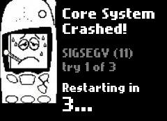
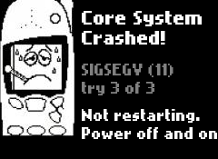

# The core crash screen, and the crash-loop guard — design and specification

**Owner files**

| File | Role |
| --- | --- |
| `neodct/src/include/nd_panic.h` | The contract: geometry, wording, the numbers the shell and the C both use |
| `neodct/src/lib/nd_panic.c` | Composing the frame, and reading a wait status |
| `neodct/src/tools/nd_panic.c` | `nd-panic`, the binary that opens the panel and runs the countdown |
| `neodct/overlay/bin/nd-crashguard.sh` | The policy: when to restart, when to stop |
| `neodct/overlay/bin/run_neodct.sh` | The boot script that sources it |
| `neodct/src/test/unit/test_panic.c` | The pixels |
| `neodct/tests/test_crashguard.py` | The policy, driven with a stub core |
| `neodct/tests/test_panic_binary.py` | The binary's exit status and pacing |

This is a *new* screen, not a port. There is no Python original: `CrashHandler`
only ever handled an app dying inside the core process, which is the case
`nd_crash.c` covers. A core that dies takes the handler with it.

---

## What this does (plain English)

When an application crashes, the phone survives: applications are separate
processes, so the core notices, writes a report, draws a screen with the sick
Nokia on it, and takes you back to the menu. `nd_crash.h` describes all of that.

When **nd-core itself** crashes there is nobody left to do any of it. Until
now the boot script printed a red `CRITICAL SYSTEM FAILURE` banner in text on
the console and then ended, and because `/etc/inittab` starts the script
`once`, nothing ever restarted it. The phone sat on that banner until somebody
pulled the battery.

Now: the same artwork appears, pinned to the left with live text beside it —
"Core System / Crashed!", what killed it, which attempt this was, and
"Restarting in 3... 2... 1..." — and then the phone brings the UI back. If it
crashes three times in a row without ever working in between, it stops, says
so, and leaves that message on the screen.

---

## 1. What draws it

This was the hard question, because whatever draws this screen must be very
unlikely to fail for the same reason nd-core just did. Three candidates.

### 1.1 The boot script, in busybox ash — rejected

It cannot do it, and the reason is in `nd_fb.c` rather than in the shell.

A framebuffer's bit depth says how wide a pixel is and **nothing at all**
about where red sits inside it, and the two framebuffers this OS runs on
genuinely disagree. QEMU's is DRM's fbdev emulation and reports
`red.offset == 16`, so a pixel is B G R x. The phone's is the kernel's vfb,
mirrored to the ST7789 by `neodct_displayd`, and reports `red.offset == 0`, so
a pixel is R G B x. `nd_fb_set_channel_order()` exists for exactly this, and
release 0.4.10a was the bug that came of assuming one order.

So a pre-rendered blob `dd`'d onto `/dev/fb0` would be correct on one of the
two framebuffers and show a blue Nokia on the other — and it would also have
to be re-rendered for 16 bpp, and there would have to be one blob per
countdown digit. Before any of that, busybox ash cannot decode a JPEG or
rasterise a TTF.

The shell keeps the **policy**. It does not keep the pixels.

### 1.2 `nd_crash_draw_engineering()` from a fresh process — rejected

It needs an `nd_ui`, and `nd_ui_init()` is the heavy end of the boot: four
font sizes, the wallpaper, `settings.prop`, the 32-entry image cache, the
input device, the notify service. Running a large fraction of the code that
may have just killed the core, in order to report that the core died, is the
wrong shape. It also draws a "Continue" softkey and then blocks on a
keypress — and nobody is coming to press it.

### 1.3 A small separate binary — chosen

`nd-panic` links `libneodct` but touches only the bottom of it: `nd_fb`,
`nd_image`'s JPEG decoder, `nd_font`, `nd_draw`, `nd_paths`, `nd_log`,
`nd_crash`'s log writer, `nd_backlight`. No `nd_ui`, no sqlite, no input, no
modem, no audio, no threads. `main()` is two ioctls and an mmap, three
`FT_New_Face` calls, one JPEG decode, and a loop of `memset`s — in a **fresh
process with a fresh heap**, which is what buys back most of the "not for the
same reason".

It is not immune, so it degrades instead of aborting:

| what is gone | what happens |
| --- | --- |
| `CRASH.jpg` | the text runs the full width of the panel |
| one font size | the other sizes stand in for it |
| all three font sizes | a solid red panel — not black, not the UI, visibly not a hang |
| `/dev/fb0` | exit 1, and the shell prints its ANSI banner instead |
| `nd-panic` itself | the shell prints its ANSI banner and does the waiting |

The last two are why the policy is in the shell: **the phone still counts
crashes, still waits and still restarts when the program that draws the pretty
version does not run at all.**

---

## 2. The screen

<p align="center">
  
  
</p>

Both are real output, not mockups:

    make -C neodct/src
    NEODCT_ROOT=<staged root> ./neodct/src/build/default/bin/nd-panic \
        --status 139 --crash 1 --limit 3 --out /frames --no-wait

240 × 175, black, no wallpaper — the same judgement `nd_crash.c` makes for the
app crash screen, and for the same reason: a photograph behind 14 px type on
the one screen whose whole job is legibility is a legibility problem.

### 2.1 The artwork

`CRASH.jpg` is a 240 × 175 picture with hand-lettered text down the left
("Application crashed :( / check serial logs.") and the sick Nokia right of
centre. The app crash screen shows all of it, full-bleed.

This screen shows **only the phone**, cropped from x 79..160, y 0..149 — 82 ×
150, measured off the file, with the top of the handset cut by the frame
exactly as it is in the original. It is blitted at (0, 0).

Cropped and **not resized**: a resample would soften every hand-drawn line and
the phone would stop looking like the phone on the other crash screen. It also
means no allocation beyond the crop and no Lanczos pass in the failure path.

### 2.2 The text column

x 90..239, so 150 pixels, with an eight-pixel gutter between the handset and
the first letter. Rows are ink-top positions:

| row | y | size | content |
| --- | --- | --- | --- |
| headline 1 | 12 | 18 px | `Core System` |
| headline 2 | 34 | 18 px | `Crashed!` |
| cause | 70 | 14 px, grey | `SIGSEGV (11)` / `exit code 1` / `exited cleanly` |
| attempt | 90 | 14 px, grey | `try 2 of 3` (omitted when unknown) |
| lead-in | 120 | 14 px | `Restarting in` — or `Not restarting.` when halted |
| digit | 140 | 24 px | `3...` `2...` `1...` — or `Power off and on` when halted |

Both house rules apply at once, which is worth stating because they pull
opposite ways. The **row** is a fixed y, or "Core System" (which has a
descender in the y) and "Crashed!" (which has none) would sit at different
pitches and the headline would look accidentally kerned. Within the row the
string's **ink top** is pinned to that y, per `nd_font.h`, so no line moves
because of which letters are in it.

### 2.3 Why 18 px and not 24

Measured, in the 150 px column:

| | 14 px | 18 px | 20 px | 24 px |
| --- | --- | --- | --- | --- |
| `Core System` | 107 | **137** | 153 | 183 |
| `Crashed!` | 75 | **97** | 108 | 129 |

20 px overflows by three pixels and silently loses the final `m` off the right
edge of the panel. That is what the first draft did, and it built, ran and
looked almost right. `test_panic.c`'s `t_nothing_runs_off_the_panel` asserts
that no ink in the text column reaches the last column or the last row, for
every status the screen can show, in both modes — and it fails if the headline
is put back to 20 px.

`Power off and on` fits by three pixels and lost its full stop to get there.

### 2.4 Wording

`Power off and on` and not "press the power key", because **there is no power
key**: the sixteen are NaviKey, C, Up, Down, 0-9, `*` and `#`. Cutting the
power is the only move the owner has left, and it is also a real repair for a
real class of fault — which is why the crash count deliberately does not
survive it (§3.3).

There is no `0...` frame. `nd_panic_countdown_text()` returns an empty string
at zero and the lead-in becomes `Restarting...` on its own, because
"Restarting in" with a blank line under it reads as a screen that has stopped
updating rather than one that is about to act.

### 2.5 The countdown

`nd-panic` draws one frame a second and sleeps between them, so the call takes
exactly as long as the number on the screen says. **The shell has no sleep of
its own** — adding one would double the countdown the owner is reading.

Only the 24 px digit changes between frames; `test_panic.c` pins that at most
24 rows differ between the "3..." and "2..." frames, which is what makes the
screen read as a countdown rather than as a flicker.

---

## 3. The guard

### 3.1 The shape of the loop

`/etc/inittab` still runs `run_neodct.sh` `once`. The loop is inside the
script, in `guard_supervise`:

```
run nd-core
    exited?      -> how long did it live?
    healthy      -> this death is crash 1 of a new streak
    not healthy  -> crash N+1
    N >= 3       -> halt screen, stop
    status != 0  -> crash screen with countdown, go again
    status == 0  -> go again, quietly
```

### 3.2 "Consecutive" is measured by how long the core lived

Not by a clock running beside it. A core that ran `ND_PANIC_HEALTHY_SECONDS`
(120) was a working phone, so whatever kills it afterwards starts a new streak.
Two minutes is well past every boot-time failure — modem enumeration, the first
database open, the first-boot wizard — and well short of a session anybody
would call short.

The measurement is a `/proc/uptime` delta. **Not `date +%s`**: this phone has
no battery-backed RTC, boots at the epoch, and ClockService may move the wall
clock forward by fifty years partway through the very run being measured,
which would make every crash look healthy.

### 3.3 The count is a shell variable

Not a file. The loop is one shell process for the life of the boot, so a
variable is sufficient — and it cannot be defeated by a `/NeoDCT/User` that is
full, read-only or never got mounted, which is a plausible cause of the crash
being counted.

It therefore does not survive a power cycle, deliberately. A phone that halted
and was switched off and on again gets its three attempts back. Pulling the
battery is a real repair, and booting straight into "not restarting" without
having tried would answer a question the owner did not ask.

### 3.4 Why it halts rather than rebooting

A full reboot is available and was considered as a middle tier. It is
rejected: on this hardware a reboot is twenty to thirty seconds of
re-enumerating the modem and re-opening every database, and if the fault is
deterministic — which three crashes in a row strongly suggests — a reboot loop
is the crash loop again with a longer period and more flash writes. Halting
holds the message still.

The serial gettys on `ttyFIQ0` and `ttyAMA0` are respawned by init and are
still there behind the halt screen, so a developer looking at a halted phone
has a shell, `/NeoDCT/User/logs/core.log` and the crash log the whole time.
The owner has a sentence. Both are better than a frozen home screen.

### 3.5 A clean exit is not a crash, but it is still counted

`nd-core` exiting 0 means it was asked to stop — normally init, on the way to
a poweroff that is about to take the script with it. It gets no crash screen.

It is still counted, because a core that exits 0 instantly in a loop spins
exactly as hard as one that segfaults, and the guard is the only thing between
that and a phone that never boots. A repeated clean exit therefore ends in a
halt screen reading `exited cleanly`.

`guard_supervise` also traps TERM/INT/HUP. Without it, a poweroff (which
signals every process at once) could see the loop start nd-core one more time
before the shell handled its own signal, and the phone would spend its last
second before switching off booting.

---

## 4. Logging

`nd-panic` calls `nd_crash_log("nd-core", ...)`, so the death of the core lands
in `/NeoDCT/User/logs/crash.log` in the same shape as an application's, with
`note: consecutive crash 2 of 3`. The log is written **before** the framebuffer
is opened, because it is the half that survives a panel that will not open.

`si_code` and `fault_addr` stay zero. An app's come from its own signal handler
over a pipe (`nd_crash_install_child`); the core has no such channel, because
it *is* the reader. All that survives is the wait status, and the log says so
rather than printing a plausible zero.

### 4.1 A bug fixed on the way past

`run_neodct.sh` ran `nd-core 2> "$CRASH_LOG"` with
`CRASH_LOG=/NeoDCT/User/logs/crash.log` — the same file `nd_crash.c` appends
application crash reports to. `2>` truncates, so **every boot destroyed the
entire history of every application crash**, and for the rest of the session
the two writers held independent file offsets, so nd-core's stderr overwrote
whatever had been appended.

nd-core's stderr now goes to `/NeoDCT/User/logs/core.log`, appended (so a
restart loop keeps the evidence from the crash *before* the one on screen,
which is the crash you actually want), and rotated aside once per boot.

---

## 5. The command

```
nd-panic [--status N] [--crash N] [--limit N] [--seconds N]
         [--halt] [--no-log] [--no-wait] [--fb DEVICE] [--out DIR]
```

`--status` is the shell's `$?`: `128+signo` for a signal, or an exit code.
128+n is read as a signal because that is what busybox ash reports for one, and
nd-core's own fatal handler re-raises so the status names the real signal. A
program that genuinely exits 139 is indistinguishable from one that
segfaulted; that ambiguity is in the exit-status convention and is not ours to
resolve.

**The exit status is a contract.** 0 means something reached the panel *and*,
for a restart, the countdown has already been waited out — the shell restarts
on the next line. Anything else means nothing was drawn, and the shell prints
its banner and does the waiting itself.

`--out DIR` renders the frames to PNGs instead of a device. It is the cheapest
way to look at a change to this screen, it is what produced the reference
images, and it is what `test_panic_binary.py` times the countdown through —
there is no framebuffer on a build host. `--no-wait` skips the sleeps for a
harness that only wants the pictures.

---

## 6. What is not covered by a host test

The framebuffer write itself. There is no `/dev/fb0` on the build host, so
`nd_fb_open` → `nd_fb_update` in `nd-panic` is exercised only on QEMU or the
phone. Everything up to and including the composed 240 × 175 RGB888 frame is
tested; `nd_fb.c`'s packing and centring have their own tests
(`test_nd_fb.c`), and this binary hands it an ordinary canvas like any other
caller.

`nd_backlight_on(100)` is likewise untested here: there is no backlight to
find, and the call is a documented no-op in that case. It is there because the
idle blanker and the Sleepy app can leave the panel dark, and a crash screen
drawn beautifully into a black panel is not a crash screen.
